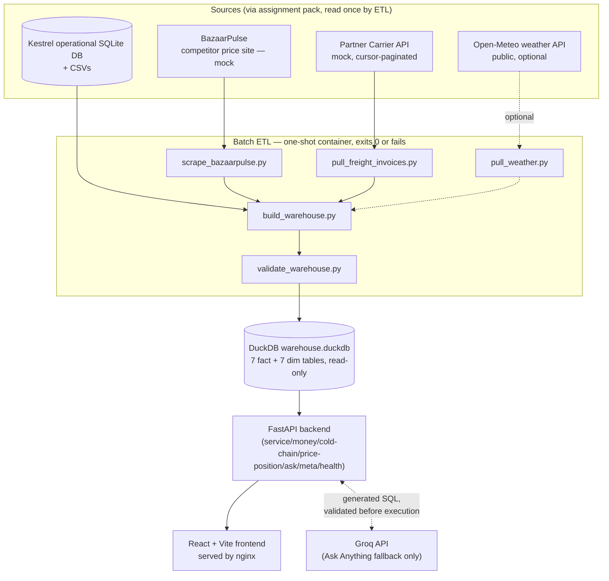
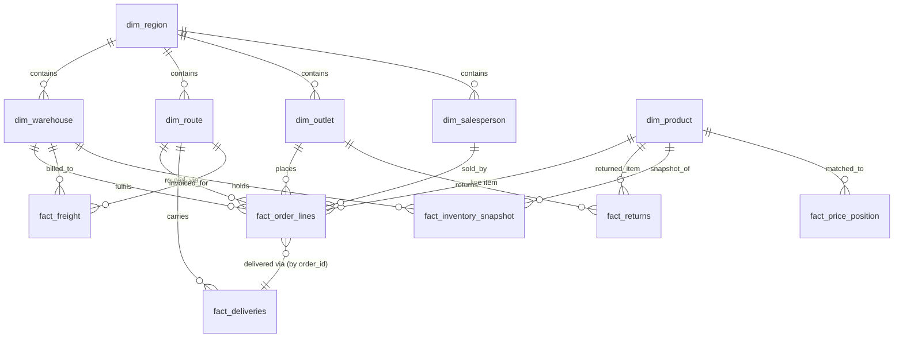

# Kestrel Control Tower

A supply-chain control tower for Kestrel Provisions, a food and grocery distributor moving ambient, chilled, and frozen product from 8 distribution centres to 724 retail outlets across 5 regions. It gives ops leadership one screen for where service and money are being lost, a lighter view on cold chain and competitor pricing, and a plain-English question box answered from the same underlying numbers as the dashboard.

Read [`DECISIONS.md`](DECISIONS.md) first — one page, and it explains what was built, what was deliberately left out, and the judgement calls behind the numbers. This README is the "how it works and how to run it" companion; [`docs/HLD.md`](docs/HLD.md) goes deeper on architecture for anyone who wants it.

**Key capabilities:** service metrics (fill rate, OTIF) by outlet/region/warehouse/route · freight cost and returns leakage · cold chain (temperature excursions, near-expiry stock) · competitor price position · a natural-language "Ask Anything" query box with 8 deterministic fast paths and an LLM fallback · a regional-manager filter · rule-based personal-data protection · a read-only SQL safety guard.

**Technology at a glance:** React 18 + Vite (frontend) · FastAPI + Pydantic (backend) · DuckDB (analytical warehouse) · Groq (LLM fallback for free-form questions) · Docker Compose (packaging) · pytest (197 tests) + a 21-question evaluation set + a 37-check warehouse validation gate.

---

## Table of contents

1. [Overview](#1-overview)
2. [What the Application Provides](#2-what-the-application-provides)
3. [Key Business Metrics](#3-key-business-metrics)
4. [Ask Anything / AI Architecture](#4-ask-anything--ai-architecture)
5. [Privacy & Security](#5-privacy--security)
6. [System Architecture](#6-system-architecture)
7. [High-Level Data Flow](#7-high-level-data-flow)
8. [ETL Pipeline](#8-etl-pipeline)
9. [Warehouse Design](#9-warehouse-design)
10. [API](#10-api)
11. [Frontend](#11-frontend)
12. [Project Structure](#12-project-structure)
13. [Technology Stack](#13-technology-stack)
14. [Quick Start](#14-quick-start)
15. [Environment Variables](#15-environment-variables)
16. [Testing & Validation](#16-testing--validation)
17. [Assignment / Acceptance Criteria Coverage](#17-assignment--acceptance-criteria-coverage)
18. [Design Decisions](#18-design-decisions)
19. [Known Limitations & Production Considerations](#19-known-limitations--production-considerations)
20. [What I Would Build Next](#20-what-i-would-build-next)
21. [Troubleshooting](#21-troubleshooting)
22. [Documentation Map](#22-documentation-map)

---

## 1. Overview

Kestrel's Head of Supply Chain Operations described spending the first ninety minutes of every day reconstructing what happened yesterday from four conflicting numbers, then wanting to ask follow-up questions in plain English rather than filing a ticket. The Control Tower answers that brief directly: one screen that surfaces where service and money are being lost without being asked, a query box for the questions that come up after, and a regional-manager filter so a person responsible for one region sees their own slice of it.

It is a decision-support tool, not a system of record — every number it shows is derived, read-only, from a fixed historical snapshot of Kestrel's operational data (1 Jan 2025 – 30 Jun 2026), not a live feed. The intended users are ops leadership (the full-network view) and regional managers (the same views, scoped to one region). It supports decisions like: which outlets need a fill-rate intervention this month, where freight cost per case is highest, which SKUs are driving return value, and whether Kestrel's pricing is competitive in a given city.

## 2. What the Application Provides

**Overview** — the front page. Shows FY2027 Q1 (the board's first question, per the brief) service and money KPIs at a glance, the five worst fill-rate outlets, the largest return-leakage category, freight cost extremes by warehouse, and two network-wide findings (below) — all without the user having to ask or click through.

**Service** (`/service`) — fill rate and OTIF, each groupable by outlet, region, warehouse, or route, with a period picker (fiscal quarter or calendar month). Fill rate is reported in eaches, not cases (see §3). OTIF uses a strict, no-tolerance in-full definition, which the page explains reads near-zero by design, with average fulfilment % shown alongside as the actionable signal. The page also surfaces the network-wide late-routes finding (below) with a per-route breakdown.

**Money** (`/money`) — freight cost per delivered case by warehouse (or total freight and invoice count by carrier — cost-per-case isn't computable per carrier, since freight invoices don't carry an order-line-level key), and returns/credit notes as a percentage of dispatch value by category, with the leading return reason code.

**Cold Chain** (`/cold-chain`) — temperature excursions per hundred chilled deliveries by month, cold-chain-linked returns (near-expiry and cold-chain-breach reason codes), and near-expiry stock from the latest weekly inventory snapshot. Deliberately the lightest-built page (see §18) but covers all three things the brief's item 2 names.

**Price Position** (`/price-position`) — Kestrel's MRP against the lowest confidently-matched competitor price scraped from BazaarPulse, for the top 20 SKUs by dispatch value in a selected city. Unmatched listings are shown as "no confident match," never guessed.

**Ask Anything** (`/ask`) — a text box, plus 8 suggested questions from the assignment brief that are answered deterministically. Anything else is answered by an LLM (Groq) that writes SQL against the same warehouse, validated read-only before it ever executes. See §4.

**Regional filtering** — a region selector in the top bar (sourced from `GET /meta/regions`) scopes Service, Money, Cold Chain, and Ask Anything to one of Kestrel's 5 regions. It is a client-side convenience filter, not per-user authentication — see §5. Price Position is the one page it doesn't affect: competitor listings are scraped by city, which has no mapping to Kestrel's sales regions in this dataset, and the page says so explicitly rather than silently ignoring the selector.

Two findings are deliberately surfaced as network-wide patterns rather than routine metrics, because that is what the underlying data actually shows: **all 140 routes** exceed a 2-hour-late threshold on more than 1 in 10 deliveries (network-wide average delay ~132 minutes), and **all 724 production outlets** have at some point ordered a discontinued SKU across 24 discontinued SKUs. Both are computed live from the warehouse (`backend/app/routers/ask.py`, the `q5`/`q8` handlers), not hardcoded.

## 3. Key Business Metrics

| Metric | Definition | Source | Important assumption |
|---|---|---|---|
| Fill rate | `delivered_eaches / ordered_eaches`, by outlet/region/warehouse/route | `GET /service/fill-rate` → `fact_order_lines` | **Reported in eaches, not cases.** The brief's illustrative Q1 says "case fill rate," but Rakesh Menon's follow-up email explicitly overrides it (modern trade penalises Kestrel on units short, not cases short) — this is a locked decision applied uniformly, including to Q1 itself. Scoped to orders with status DELIVERED or PARTIAL; CANCELLED/OPEN orders excluded by default. |
| OTIF (strict) | On-time (`delay_minutes <= 0`) AND fully in-full (`delivered_eaches >= ordered_eaches`), no tolerance | `GET /service/otif` → `fact_order_lines` + `fact_deliveries` | Reads near-zero almost everywhere: 0 of 511,516 order lines, across every order status, ever fully deliver against what was ordered. This is a reported finding about the data, not tuned away with an arbitrary tolerance — `avg_fulfilment_pct` (a continuous, non-boolean metric) is shown alongside as the actionable signal. |
| Temperature excursions | Excursion-flagged deliveries per 100 chilled deliveries, by month | `GET /cold-chain/excursions` → `fact_deliveries` | A delivery counts as "chilled" if any order line on its order is a chilled SKU — the deliveries table has no per-shipment chilled flag, only a whole-shipment excursion flag, so mixed ambient+chilled shipments are included. |
| Near-expiry stock | On-hand cases with `days_to_expiry` in `[0, near_expiry_days]` (default 30), as of the latest weekly snapshot | `GET /cold-chain/near-expiry` → `fact_inventory_snapshot` | Computed directly from `expiry_date - snapshot_date`, **not** from the source `ageing_bucket` column — checked, and that column is uncorrelated with actual days-to-expiry (all four buckets average ~100 days regardless of label), so it's carried through for reference but never relied on. |
| Returns leakage | Credit-note value as % of dispatch value, by category, with leading reason code | `GET /money/returns-leakage` → `fact_returns` + `fact_order_lines` | Return quantities with a negative sign in the source data are taken as `abs()` during ETL — a documented sign bug, not a refund/reversal signal. |
| Freight cost per case | `freight_inr / delivered_cases`, by warehouse | `GET /money/freight-cost-per-case` → `fact_freight` + `fact_order_lines` | Freight invoice date and order date are filtered to the same period independently (invoices aren't individually linkable to a specific order) — "freight billed in period X" over "cases delivered in period X," not a line-by-line reconciliation. |
| Price position | Kestrel MRP vs. lowest observed competitor price, for confidently-matched SKUs | `GET /price-position/gap` → `fact_price_position` | Matching is conservative: brand + category + normalised pack size, with a name-overlap tiebreak. 614 of 1,137 scraped listings (54%) match with confidence; the rest are excluded from every price-gap view entirely, never guessed. |

## 4. Ask Anything / AI Architecture

This is the request lifecycle exactly as implemented in `backend/app/routers/ask.py`, not a generic template — each branch below corresponds to a real check in `ask()`.

```mermaid
flowchart TD
    A[User question] --> B{Matches one of the<br/>8 fast-path keyword sets?}
    B -->|Yes| C[Hand-written, parametrized SQL<br/>against fact/dim tables]
    C --> R1[mode = fast_path]

    B -->|No| D{Question-level privacy check<br/>blocked-phrase list}
    D -->|Blocked category, e.g.<br/>'salesperson full names'| X[mode = blocked<br/>sql = null, Groq never called]
    D -->|Clear| E{PII-shaped value in question?<br/>email / phone / Aadhaar / PAN regex}
    E -->|Detected| X
    E -->|Clear| F{GROQ_API_KEY configured?}
    F -->|No| U[mode = unavailable]
    F -->|Yes| G[Groq generates SQL<br/>+ answer_intro, JSON mode]
    G -->|network/parse failure| L1[mode = llm_error]
    G -->|SQL returned| H[sql_guard.validate_readonly_sql]
    H -->|fails: mutation keyword, disallowed<br/>table, comma join, multi-statement| L2[mode = llm_error, SQL shown]
    H -->|passes| I[privacy.check_sql_for_blocked_columns]
    I -->|references a blocked column| X
    I -->|clear| J[Execute read-only, DuckDB<br/>interrupt() after ASK_QUERY_TIMEOUT_SECONDS]
    J -->|timeout / DB error| L3[mode = llm_error, SQL shown]
    J -->|rows returned| K[privacy.check_result_for_blocked_columns]
    K -->|blocked column in result keys| X
    K -->|clear| M[mode = llm<br/>SQL shown behind Show SQL toggle]
```

**Why deterministic fast paths come first.** The 8 illustrative questions from the assignment brief are answered by hand-written, parametrized, tested queries with zero dependency on Groq — matched by simple keyword-set checking (`match_fastpath()`), not NLP. They are correct by construction, safe by construction (fixed SQL text, no LLM in the loop, nothing to guard against), and always take priority even when a Groq key is configured — a fast-path match short-circuits the entire privacy/Groq/guard pipeline below it.

**Why the LLM is a fallback, not the primary path.** Groq-generated SQL is syntactically-valid-but-semantically-imprecise on some novel phrasings — an acknowledged, inherent limitation of NL-to-SQL, not something this build claims to have solved. Reserving it for questions the 8 known ones don't cover keeps the common, illustrative questions fully deterministic while still answering "why did fill rate drop in the West last week"-style questions the brief specifically wants.

**SQL generation.** Groq is given a compact, hand-written schema description (table and column names only — every personal-data column is excluded by construction, `assert`-checked at import time) and asked for exactly one `SELECT`/`WITH...SELECT` query plus a one-sentence, pre-results answer lead-in, as JSON (`response_format={"type": "json_object"}`, `temperature=0`).

**SQL validation (`backend/app/sql_guard.py`).** Every piece of Groq-generated SQL — with no exceptions — is passed through `validate_readonly_sql()` before it ever reaches the database: single-statement only, `SELECT`/`WITH` only, a forbidden-keyword regex blocks `INSERT/UPDATE/DELETE/DROP/ALTER/ATTACH/DETACH/CREATE/PRAGMA/COPY/EXPORT/IMPORT/CALL/INSTALL/LOAD/VACUUM/CHECKPOINT/GRANT`, a table allowlist checks every `FROM`/`JOIN` target (bare, quoted, or schema-qualified) against the 14 approved analytical tables, comma-separated implicit joins are rejected outright, and a query with no `LIMIT` gets one appended (500 rows). A query that fails any check degrades to `mode="llm_error"` with the rejection reason shown — never a 500, never a silent partial result.

**Privacy protection** runs at four points around that guard — see §5.

**SQL visibility in the UI.** The generated (or fast-path, where hand-written SQL is shown for the two systemic-finding questions) SQL is collapsed behind a **Show SQL** / **Hide SQL** toggle beneath the answer — hidden by default so the plain-English answer stays primary, but one click away for auditability. The toggle is never rendered at all for `mode="blocked"` responses — a blocked/privacy response has nothing worth auditing there. Each answer card keys off a stable per-answer id (not its position in the list), so expanding SQL on one answer never causes a subsequently-submitted answer to render already expanded.

**Handling of novel questions.** A genuinely novel, safe question (e.g. "Which region has the highest freight cost?") reaches Groq, gets a generated query, and is answered as `mode="llm"` with the SQL shown. A question outside the schema entirely (e.g. "what's the capital of France") still gets a Groq-generated response — the guard and privacy checks don't know or care whether the *question* was in-domain, only whether the *SQL* is safe; an off-domain question typically just produces an unhelpful but harmless query, degrading gracefully rather than erroring.

**Limitations, stated plainly:** Groq can produce a syntactically valid but semantically imprecise query for an unusual phrasing (a date-window mismatch, for example) — contained by fast-path priority, the restricted schema, and SQL visibility, not eliminated. The question-level privacy phrase list is a fixed list, not a parser — a sufficiently unusual phrasing could theoretically slip past that *first* layer, though the SQL-level and result-level layers behind it still hold, since the LLM's schema never includes the blocked columns at all.

## 5. Privacy & Security

Personal data in this dataset is outlet contact details and a handful of Kestrel employee-name fields carried on otherwise-legitimate business dimension tables — there is no individual-customer table at all. Every check below is a static allowlist/blocklist or a regex in `backend/app/privacy.py`; there is no second LLM asked to judge what's personal, so the policy is auditable and doesn't depend on a model's judgement.

**Blocked columns** (`PII_BLOCKED_COLUMNS`): `dim_outlet.contact_name/contact_phone/contact_email/gst_number`, `dim_salesperson.full_name`, `dim_warehouse.manager_name`, `dim_region.regional_manager` (this last one is legitimately shown in the region-selector UI via `GET /meta/regions`, a separate, fixed, brief-driven feature — blocking it from the LLM path doesn't affect that endpoint). Everything else the app runs on — `outlet_code`, `route_code`, `warehouse_code`, `sku_code`, `region_code`, and the rest of the operational identifiers — is explicitly *not* personal data and stays available to free-form questions.

Four layers, all before/around the SQL guard, not replacing it:

1. **Schema filtering** — the schema description sent to Groq excludes every blocked column by construction; an `assert` at import time fails the container's own startup if a blocked column name ever appears in it.
2. **Question-level blocking** — a fixed phrase list (`_BLOCKED_REQUEST_PHRASES`) catches a request *for* a personal-data category before Groq is ever called, and a separate regex layer catches a PII-shaped *value* embedded in the question (email, phone, Aadhaar-style, PAN-style). Both run before any Groq call.
3. **SQL-level blocking** — after `sql_guard` passes (it only checks table names, not columns), a word-boundary scan rejects the SQL if it references any blocked column by name — catching `SELECT contact_email FROM dim_outlet`, which passes the table-level guard since `dim_outlet` is an approved table.
4. **Result-level blocking** — a final check on the actual result rows' column names, independent of what the SQL text looked like.

Any hit at any layer returns `mode="blocked"` with a fixed, generic message ("Sorry, personal data cannot be queried through Ask Anything.") — never the original question, a detected value, or a stack trace. Blocked requests are logged with a safe reason token only (e.g. `ask_privacy_blocked reason=blocked_sql_column`) — never the question text or the value that triggered the block.

Verified, safe examples (all covered by tests — `backend/tests/test_privacy.py`, `backend/tests/test_ask_llm.py`):

- `"List all salesperson full names"` → blocked at the question layer, before Groq is ever called.
- `"Give me phone number 9876543210"` → blocked at the question layer (PII-shaped value detected).
- A SQL-injection-shaped question (`'; DROP TABLE fact_order_lines; --`) → never executed as injected; the LLM path treats it as a question, the guard only ever lets a validated read-only `SELECT` reach the database, and DuckDB is queried with parameter binding throughout the fast paths.
- `"Which region has the highest freight cost?"` → not blocked; reaches Groq normally.

**SQL injection handling.** There is no code path anywhere in this application that concatenates user input directly into executable SQL. Fast-path queries use bound parameters exclusively. The one path that runs LLM-authored SQL text goes through `sql_guard.validate_readonly_sql()` first, which structurally cannot produce a mutating or multi-statement query, and only ever executes against the 14-table analytical allowlist.

**Read-only guarantees.** The backend connects to `warehouse.duckdb` with `read_only=True` on every request (`backend/app/db.py`). The raw operational schema (`raw.*`) is physically dropped after the ETL build (`DROP SCHEMA raw CASCADE` in `build_warehouse.py`) — it does not exist in the file the backend ever opens, so there is no raw table to reach even if a check were somehow bypassed.

**What is intentionally outside production scope — stated plainly, not framed as a feature:** there is no authentication, no authorization/RBAC, and no rate limiting on the API. Anyone who can reach port 8000 can call every endpoint, including `/ask`, with no notion of "a user's own region" to enforce — the region selector is a client-side scoping convenience, not an access boundary. This is an accepted, documented scope boundary for a single-tenant take-home assignment (see §19), not a claim that the system is production-hardened.

## 6. System Architecture



**Component responsibilities:**

- **ETL (one-shot container)** — extracts, cleans, and reconciles all five sources exactly once per run into the warehouse, then validates it. Never runs again until the container is re-run.
- **DuckDB warehouse** — a single embedded file, the only thing the backend ever reads. No raw operational data exists in it.
- **FastAPI backend** — stateless, read-only query execution over the warehouse; one short-lived DuckDB connection per request (embedded-file open/query/close is sub-millisecond at this volume, so no connection pool is needed — see §19).
- **React/Vite frontend** — a static single-page app built at Docker image build time and served by nginx; talks to the backend over plain HTTP `fetch`.
- **Groq** — the only external network call the *running application* makes at request time (ETL's external calls all happen once, up front, before the backend ever starts). Used only for the Ask Anything fallback; every other page and the 8 fast-path questions have zero runtime dependency on it.

Docker Compose health-gates the whole chain: `bazaarpulse` and `partner-api` must report healthy before `etl` starts; `etl` must exit 0 (`service_completed_successfully`) before `backend` starts; `backend` must report `status="ok"` on `/health` (not just HTTP 200 — a "degraded" body still fails the healthcheck) before `frontend` starts.

## 7. High-Level Data Flow

**Batch ETL (once per `docker compose up`, or on demand):** operational SQLite DB + CSVs, BazaarPulse listings, and freight invoices are pulled/scraped/cached to disk → `build_warehouse.py` cleans, joins, and normalises everything into fact/dim tables in a fresh `warehouse.duckdb` → `validate_warehouse.py` runs 37 data-quality checks against that exact file and writes a pass/fail verdict directly into it (`_warehouse_meta` table) → the ETL container exits 0 only if validation passed.

**API serving (per request):** the backend opens a read-only connection to the already-built, already-validated warehouse, refuses to serve at all if `_warehouse_meta` shows a failed or missing validation (503, both via `docker compose`'s own gate and independently inside `db.get_connection()` for any warehouse reached outside that path), and returns typed, capped (`MAX_ROWS_RETURNED`) JSON.

**Browser UI:** React fetches from the backend on page load and on every filter/period/region change; each page independently handles loading, error, and empty states (`DataState` component, §11) rather than blocking the whole page on one slow call.

**Ask Anything (distinct from the dashboard's fixed-query flow):** described in full in §4 — either a hand-written fast-path query or a Groq-generated, guarded, privacy-checked query against the same warehouse the dashboard reads.

## 8. ETL Pipeline

Five source-specific steps, run in order by `etl/Dockerfile`'s `CMD`, each writing to a local cache (`cache/bazaarpulse/`, `cache/freight/`, `cache/weather/`) so a re-run skips completed work unless `--refresh` is passed:

1. **`scrape_bazaarpulse.py`** — scrapes 4 cities' listing pages from BazaarPulse (a static mock site). Fetches and parses the live `robots.txt` via `urllib.robotparser` before every request (`can_fetch()`), reads the site's own `PAGINATION.txt` per city rather than assuming a pagination scheme, and handles four different price-markup variants that appear across cards. Writes `listings.csv`.
2. **`pull_freight_invoices.py`** — walks the mock Partner Carrier API's cursor-paginated `/v1/freight_invoices` endpoint (~41,500 rows), honouring `429 Retry-After` and retrying `503` with exponential backoff; checkpoints cursor progress to disk after every page so a killed run resumes rather than restarting. Converts paise → INR and UTC → IST on write. This is the only source of *actual* billed freight cost (`deliveries.fuel_cost_inr` is driver-entered and unreconciled per the data dictionary).
3. **`pull_weather.py`** — pulls daily max temperature and precipitation for each of the 8 warehouse cities from the public Open-Meteo archive API. Explicitly optional: a network failure here is logged and swallowed, never raised — the app runs with zero weather data if this can't reach the internet.
4. **`build_warehouse.py`** — loads the operational SQLite DB into a temporary `raw` schema in DuckDB (via `sqlite3` + `pandas`, not the `sqlite_scanner` extension, which needs a network fetch that's blocked in locked-down environments), applies every documented cleaning rule exactly once (city-name canonicalisation, outlet dedup by GST/geo not name, test-outlet flagging, eaches conversion, return-sign correction, per-source timestamp parsing, near-expiry from `expiry_date - snapshot_date`, price matching by brand+category+pack-size), writes 7 dimension and 7 fact tables, then drops the `raw` schema entirely.
5. **`validate_warehouse.py`** — the data-quality gate (§9, §16). Runs 37 checks; a non-zero exit fails the container.

**Failure behaviour:** each pull script retries what's retriable (rate limits, transient 503s) and fails loudly on what isn't. `build_warehouse.py` prints a warning (not a hard failure) if it finds an unexpected `qty_uom` or unmatched freight `warehouse_code`, since those are data anomalies worth surfacing, not necessarily build-breaking. The container as a whole only succeeds if every step, including validation, exits 0 — `docker-compose.yml`'s `service_completed_successfully` condition on `etl` means the backend never starts against a partially-built or invalid warehouse.

## 9. Warehouse Design

Single-file DuckDB (`warehouse.duckdb`), read-only for every consumer (backend, and by extension the Ask Anything LLM path). Star-schema-shaped: 7 dimension tables, 7 fact tables, grain documented per table below.

| Table | Rows (current build) | Grain | Key relationships |
|---|---:|---|---|
| `dim_region` | 5 | one row per sales region | referenced by `region_id` from every fact table and `dim_outlet`/`dim_warehouse`/`dim_route` |
| `dim_warehouse` | 8 | one row per distribution centre | `region_id` → `dim_region` |
| `dim_route` | 140 | one row per delivery route | `region_id` → `dim_region` |
| `dim_salesperson` | 95 | one row per field sales employee | `region_id` → `dim_region` |
| `dim_outlet` | 724 | one row per retail outlet | `region_id` → `dim_region`; carries `is_test_outlet`/`is_deleted`/`is_duplicate_outlet` flags |
| `dim_product` | 341 | one row per SKU | carries `is_discontinued`/`discontinued_date` |
| `dim_date` | 576 | one row per calendar day, 2025-01-01 to 2026-07-31 | fiscal year/quarter pre-computed (Apr–Mar FY, year-ending label) |
| `fact_order_lines` | 511,516 | one row per order line | → `dim_outlet`, `dim_product` (via `sku_code`), `dim_region`, `dim_route`, `dim_warehouse`, `dim_salesperson` |
| `fact_deliveries` | 76,889 | one row per delivery (≈ one per order) | → `dim_route`, `dim_warehouse`, `dim_outlet`, `dim_region`; relates to `fact_order_lines` via `order_id` |
| `fact_returns` | 14,000 | one row per credit note | → `dim_outlet`, `dim_region`, `dim_product` |
| `fact_freight` | 41,500 | one row per freight invoice | → `dim_warehouse`, `dim_route`; carrier is a denormalised text field, not a separate dimension |
| `fact_inventory_snapshot` | 131,040 | one row per warehouse × SKU × batch × weekly snapshot | → `dim_warehouse`, `dim_product` |
| `fact_price_position` | 1,137 | one row per BazaarPulse listing | → `dim_product` (via `sku_code`, only where `match_confidence='matched'`) |
| `fact_weather` | 0–232 (optional) | one row per city × day | not joined to any other fact table; degrades to empty if the weather pull couldn't reach the internet |



Why this model suits the dashboard: every API endpoint is a single aggregation query over one or two fact tables joined to a small dimension table, with no multi-hop joins across the fact layer — that's what keeps every dashboard endpoint a straightforward, hand-auditable SQL statement, and it's the same reason the Ask Anything schema description (§4) can be kept short enough for an LLM to reason about correctly.

**Data-quality assumptions, enforced by `etl/validate_warehouse.py` (37 checks):** every required table exists and is non-empty; primary keys are unique; business/join keys (`order_line_id`, `outlet_id`, `sku_code`, ...) carry no unexpected nulls; foreign keys resolve (`fact_order_lines.outlet_id → dim_outlet.outlet_id`, `fact_deliveries.route_id → dim_route.route_id`, `fact_deliveries.warehouse_id → dim_warehouse.warehouse_id`, `fact_returns.outlet_id → dim_outlet.outlet_id`); order/delivery dates fall inside the dataset's known window; and two of this project's own documented findings still hold (exactly 3 test outlets, `match_confidence` only takes its 3 documented values). The verdict is written into the warehouse file itself (`_warehouse_meta`), so both the Docker startup gate and the backend's own `db.get_connection()` refuse to serve a warehouse that failed or never ran this gate.

## 10. API

FastAPI, served at `http://localhost:8000` (Docker) or wherever `uvicorn` is bound locally. Interactive docs at `/docs` (FastAPI's built-in Swagger UI) once the backend is running.

| Endpoint | Method | Purpose |
|---|---|---|
| `/health` | GET | Reports `status="ok"`/`"degraded"`, warehouse presence + validation status, table list, and whether `GROQ_API_KEY` is configured. Backs the Docker healthcheck. |
| `/meta/regions` | GET | Active regions (code, name, regional manager) — backs the region selector. |
| `/service/fill-rate` | GET | Fill rate (eaches), groupable by outlet/region/warehouse/route, with fiscal/calendar period and region filters. |
| `/service/otif` | GET | Strict OTIF, on-time %, and average fulfilment %, groupable by region/warehouse/route/outlet. |
| `/money/freight-cost-per-case` | GET | Freight cost per delivered case by warehouse, or total freight/invoice count by carrier. |
| `/money/returns-leakage` | GET | Return value as % of dispatch value by category, with leading reason code. |
| `/cold-chain/excursions` | GET | Temperature excursions per hundred chilled deliveries, by month. |
| `/cold-chain/returns` | GET | Returns tagged with a cold-chain-related reason code, by category. |
| `/cold-chain/near-expiry` | GET | Near-expiry stock (configurable day window) from the latest inventory snapshot, by category or warehouse. |
| `/price-position/gap` | GET | Kestrel MRP vs. lowest competitor price for top-N SKUs by value, optionally scoped to one city. |
| `/price-position/summary` | GET | Average/min/max MRP gap % by category. |
| `/ask` | POST | Ask Anything — see below. |
| `/ask/supported-questions` | GET | The 8 fast-path question texts, for the UI's suggestion chips. |

Every dashboard metric endpoint returns the same shape (`MetricResponse`): `metric`, `group_by`, `period_label`, `filters_applied`, `rows` (each with `dimension`, `dimension_label`, and a `metrics` dict), and `caveats` — a list of plain-English methodology notes specific to that query (shown in the UI behind a "methodology" disclosure, not hidden).

**`POST /ask` request:**
```json
{ "question": "Which region has the highest freight cost?", "region_code": "WST" }
```
`region_code` is optional and only applied where the matched question's underlying data supports a region filter.

**`POST /ask` response** (`AskResult`): `question`, `mode` (one of `fast_path` / `llm` / `llm_error` / `unavailable` / `blocked`), `answer`, `data` (rows, or `null`), `sql` (the executed SQL, or `null` for a blocked/unavailable response), `source`, `caveats`, `matched_question_id` (fast-path only). A `blocked` response always has `sql: null` and `data: null` — nothing about the query that triggered the block is ever returned. No endpoint in this API exposes secrets, API keys, or file-system paths in its response body.

## 11. Frontend

React 18 + Vite, client-side routed with `react-router-dom` (`frontend/src/App.jsx`), 6 routes: `/` (Overview), `/service`, `/money`, `/ask`, `/cold-chain`, `/price-position`, all rendered inside a shared `Layout` (sidebar nav + top bar with the fiscal-period badge and region selector).

**API communication** — a thin `fetch` wrapper (`lib/api.js`, `apiGet`/`apiPost`) that surfaces a friendly "Could not reach the API" message on network failure and unwraps the backend's `detail` field on a non-2xx response; a small `useApi` hook wraps that with loading/error/data state for GET calls used across every page.

**Regional selector** — `RegionContext` fetches `/meta/regions` once at app load and exposes `regionCode`/`setRegionCode` via React context; every page that supports scoping reads `regionCode` and threads it into its own API calls. If `/meta/regions` fails, the selector degrades to "All Regions only" rather than breaking the page.

**Charts/cards** — a small shared component set: `Card` (the page's panel primitive), `Kpi`/`KpiRow` (the Overview headline numbers), `MetricTable` (a sortable-by-nature, bar-annotated data table used on every metric page), `Callout` (methodology/warning/systemic-finding call-outs), `PeriodPicker` (fiscal quarter / calendar month selector).

**Loading/error/empty states** — every data-fetching section goes through a shared `DataState` component: a skeleton loader while fetching, a retry-capable error block on failure, and an explicit "no data for this selection" block rather than a blank panel — applied consistently across all 6 pages.

**Ask Anything UI** — a text input plus the 8 suggested-question chips, and a scrolling history of answer cards. Each card shows the mode badge (Answered / Answered (AI) / AI answer unavailable / Not available), the plain-English answer, a data table when rows are returned, and any caveats. Generated/hand-written SQL is collapsed behind a **Show SQL** toggle by default, and is never rendered at all for a blocked response. Each answer card is keyed by a stable, generated-at-submit-time id rather than its position in the history list — so expanding SQL on an older answer and then asking a new question renders the new answer independently, still collapsed by default, instead of visually inheriting the older card's expanded state.

**Responsive/mobile behaviour** — a CSS breakpoint at 1000px (`frontend/src/styles.css`) collapses the sidebar into a slide-out drawer behind a burger button in the top bar, with a backdrop that closes it on tap; the drawer also auto-closes on every route change so a nav click doesn't leave it open over the new page.

## 12. Project Structure

Every path below is an actual file tracked in this repository (`git ls-files`), not an illustrative sketch:

```
.
├── backend/
│   ├── app/
│   │   ├── main.py            # FastAPI app + router registration + CORS
│   │   ├── config.py          # env-driven config (reuses etl/config.py)
│   │   ├── db.py              # read-only DuckDB connection + warehouse validation gate
│   │   ├── date_utils.py      # fiscal-year/quarter math
│   │   ├── query_helpers.py   # shared period/region WHERE-clause builders
│   │   ├── privacy.py         # 4-layer personal-data protection
│   │   ├── sql_guard.py       # read-only SQL validator for LLM-generated queries
│   │   ├── schemas.py         # Pydantic response/request models
│   │   └── routers/           # health, meta, service, money, cold_chain, price_position, ask
│   ├── tests/                 # pytest suite (197 tests) + eval_ask_anything.py
│   ├── requirements.txt
│   └── requirements-dev.txt
├── etl/
│   ├── config.py               # central env-driven config (source paths, API URLs, secrets)
│   ├── scrape_bazaarpulse.py   # competitor-price scraper (robots.txt-aware)
│   ├── pull_freight_invoices.py # cursor-paginated freight API puller, resumable
│   ├── pull_weather.py         # optional weather enrichment
│   ├── build_warehouse.py      # cleans + builds the DuckDB warehouse
│   ├── validate_warehouse.py   # 37-check post-build data-quality gate
│   └── requirements.txt
├── frontend/
│   ├── src/
│   │   ├── App.jsx             # routes
│   │   ├── main.jsx            # entry point
│   │   ├── pages/               # Overview, Service, Money, ColdChain, PricePosition, AskAnything
│   │   ├── components/          # Card, Kpi, MetricTable, Callout, PeriodPicker, RegionSelector, States, Layout
│   │   ├── lib/                  # api.js, useApi.js, RegionContext.jsx, fiscal.js, format.js
│   │   └── styles.css
│   ├── package.json
│   └── vite.config.js
├── docker/
│   ├── bazaarpulse.Dockerfile   # bakes bazaarpulse_site/ in at build time
│   └── partner-api.Dockerfile   # bakes partner_api/ in at build time
├── docs/
│   └── HLD.md                   # high-level design document
├── DECISIONS.md                 # one-page decisions/assumptions/limitations document
├── docker-compose.yml            # 5-service orchestration
├── .env.example
└── README.md                     # this file
```

## 13. Technology Stack

| Layer | Technology | Purpose |
|---|---|---|
| Frontend | React 18.3, React Router 6.26, Vite 5.4 | Client-rendered SPA dashboard and Ask Anything UI |
| Frontend serving | nginx 1.27-alpine | Serves the built static frontend in Docker |
| Backend | FastAPI 0.141, Pydantic 2.13, Uvicorn 0.52 | REST API, request/response validation |
| Warehouse | DuckDB 1.5.5 | Embedded analytical database, single read-only file |
| ETL | Python 3.11, pandas | Extraction, cleaning, transformation into the warehouse |
| LLM | Groq API (`groq` Python SDK ≥0.11), model `llama-3.3-70b-versatile` | Ask Anything free-form fallback (NL → SQL) |
| Containerization | Docker Compose v2, BuildKit `additional_contexts` | 5-service orchestration, health-gated startup |
| Testing | pytest 8.3.4, httpx 0.28.1 | 197-test backend suite + evaluation set |

## 14. Quick Start

**Prerequisites:** Docker Desktop (or another Docker Compose v2 install — `docker compose`, not the standalone `docker-compose`), with BuildKit enabled (default on any current Docker Desktop); and the assignment pack unzipped somewhere on disk. Nothing under the pack — `data/kestrel_ops.db`, `data/csv/`, `bazaarpulse_site/`, `partner_api/` — is committed to this repository.

```bash
cp .env.example .env
# edit .env: set ASSIGNMENT_PACK_DIR to wherever you unzipped the pack
# (the folder that directly contains data/, bazaarpulse_site/, partner_api/)

docker compose up --build
```

Open **http://localhost:3000**.

That one command starts all 5 services in the right order: the two mock external services from the assignment pack, a one-shot `etl` job that scrapes/pulls/cleans everything into the warehouse and validates it, then the backend and frontend — each waiting on the previous step to actually succeed, not just start. First run takes a few minutes (a full BazaarPulse scrape and a ~41,500-row freight-invoice walk with real retry/backoff). Subsequent runs skip work already cached in the `warehouse_data`/`cache_data` named volumes; use `docker compose up --build --force-recreate` for a fully fresh pull.

If `ASSIGNMENT_PACK_DIR` is missing or blank in `.env`, `docker compose` refuses to start and says exactly which variable to set, rather than silently mounting a bogus path.

`GROQ_API_KEY` is optional — leave it blank and everything still works, including all 8 fast-path Ask Anything questions; free-form questions just report "AI unavailable" instead of failing. Set it (get a key at [console.groq.com/keys](https://console.groq.com/keys)) to enable the free-form path. Never commit a real key — `.env` is git-ignored for exactly this reason.

**Stop the application:**
```bash
docker compose down
```

## 15. Environment Variables

| Variable | Required | Purpose | Example |
|---|---|---|---|
| `ASSIGNMENT_PACK_DIR` | Yes (Docker) | Absolute path to the unzipped assignment pack. Used as a runtime bind-mount source for `data/`, and a build-time source for `bazaarpulse_site/`/`partner_api/`. | `/Users/you/FDE_Assignment_Pack_Kestrel_v1.1` |
| `GROQ_API_KEY` | No | Enables the free-form Ask Anything path. Blank = 8 fast paths still work, free-form reports "AI unavailable." | *(blank, or a real key from console.groq.com)* |
| `GROQ_MODEL` | No | Which Groq model answers free-form questions. | `llama-3.3-70b-versatile` |
| `GROQ_TIMEOUT_SECONDS` | No | Network timeout on the Groq API call itself. | `15` |
| `GROQ_MAX_RETRIES` | No | Retries on the Groq call, transient network/timeout failures only. | `1` |
| `ASK_QUERY_TIMEOUT_SECONDS` | No | Wall-clock cap on executing LLM-generated SQL before it's cancelled. | `10` |
| `MAX_ROWS_RETURNED` | No | Hard cap on rows returned by any single query, fast-path or LLM. | `500` |
| `ANTHROPIC_API_KEY` | No | Legacy/unused — kept for compatibility, no code path calls it. | *(blank)* |
| `KESTREL_DB_PATH` | ETL only | Path to the SQLite operational DB inside the ETL container. | `/data/kestrel_ops.db` |
| `WAREHOUSE_DB_PATH` | ETL + backend | The cleaned DuckDB store both read/write. | `warehouse/warehouse.duckdb` |
| `VITE_API_BASE_URL` | Frontend build arg | Where the browser sends API calls (baked in at build time). | `http://localhost:8000` |

No real secrets are shown above or committed anywhere in this repository — `.env` is git-ignored, and `.env.example` contains only placeholders.

## 16. Testing & Validation

```bash
pip install -r backend/requirements-dev.txt

pytest backend/tests/                        # 197 tests
pytest backend/tests/eval_ask_anything.py     # Ask Anything evaluation set (21 questions, 1 pytest wrapper)
python3 etl/validate_warehouse.py             # 37-check warehouse data-quality gate
cd frontend && npm run build                  # production build verification
```

**Current verified results** (re-run against the real warehouse as part of this session):

| Suite | File | Count | Result |
|---|---|---:|---|
| SQL guard | `test_sql_guard.py` | 33 | pass |
| Privacy layer | `test_privacy.py` | 46 | pass |
| Ask Anything / Groq orchestration | `test_ask_llm.py` | 26 | pass |
| Query-parameter validation | `test_validation.py` | 65 | pass |
| End-to-end API / illustrative questions | `test_endpoints.py` | 27 | pass |
| **Backend total** | `backend/tests/` | **197** | **pass** |
| Ask Anything evaluation set | `eval_ask_anything.py` | 21 questions (1 pytest test) | pass |
| Warehouse data-quality gate | `validate_warehouse.py` | 37 checks | pass |
| Frontend production build | `npm run build` | — | clean, no warnings |

The evaluation set covers all 8 fast paths, general analytical/regional/date-period questions, an unsupported (off-domain) question, PII category requests, PII-shaped values, SQL-injection-shaped input, and malformed/edge-case input — and separately asserts `fact_order_lines`' row count is identical before and after the full run (no mutation occurred). SQL-guard and query-parameter-validation tests need no built warehouse and run in any environment, including a completely clean checkout; everything else needs `warehouse/warehouse.duckdb` built first and skips itself cleanly (not a false pass) if it isn't there yet.

**Docker verification:** `docker compose build --no-cache && docker compose up -d` — all 5 containers report healthy/exited-0 as designed, `GET /health` returns `status: "ok"`, `warehouse_validated: true`, `llm_configured: true` when a Groq key is set.

**Browser verification:** all 6 pages render with real data; the regional selector scopes Service/Money/Cold Chain/Ask Anything; a fast-path question, a genuine Groq-answered question, a PII request, a PII-value request, and a SQL-injection-shaped question all behave as documented in §4/§5; the Show/Hide SQL toggle works on both fast-path and Groq answers and is absent on blocked responses; long generated SQL wraps without breaking layout.

## 17. Assignment / Acceptance Criteria Coverage

| Requirement | Implementation | Evidence |
|---|---|---|
| Working system, clean checkout | `docker compose up --build` | §14, verified Docker run |
| README + one-page DECISIONS.md | Both present | This file, `DECISIONS.md` (898 words / 35 lines) |
| Q1 on the front page | Overview shows FY2027 Q1 badge and KPIs immediately | `frontend/src/pages/Overview.jsx` |
| Fill rate by region/warehouse/route/outlet, in eaches | `GET /service/fill-rate`, all 4 `group_by` values, eaches-only | `backend/app/routers/service.py` |
| OTIF | Strict, no-tolerance definition, honestly reported near-zero | `backend/app/routers/service.py`, §3 |
| Regional-manager view | Region selector scoping 4 pages + Ask Anything | `RegionContext`, `GET /meta/regions` |
| Cold chain (excursions, near-expiry, returns) | 3 dedicated endpoints | `backend/app/routers/cold_chain.py` |
| Money (freight/case, returns leakage) | 2 dedicated endpoints | `backend/app/routers/money.py` |
| Price position (MRP vs. competitor) | Conservative matching, unmatched excluded | `backend/app/routers/price_position.py` |
| Ask Anything, plain English | 8 deterministic fast paths + Groq fallback | §4, `backend/app/routers/ask.py` |
| Personal-data protection | 4-layer defense-in-depth | §5, `backend/app/privacy.py` |
| SQL safety | Read-only guard, table allowlist, no injection path | §5, `backend/app/sql_guard.py` |
| Docker Compose, one command | 5-service health-gated stack | `docker-compose.yml` |
| External data ingestion (scrape + API) | BazaarPulse scraper + freight API puller | §8 |
| No raw/prohibited data committed | `.gitignore` excludes `/data/`, `*.db`, `.env`, caches | `git ls-files` shows none tracked |
| Commit history | Incremental commits, not one final push | `git log` |

## 18. Design Decisions

`DECISIONS.md` is the canonical, one-page source for this — read it in full for the reasoning; this is a pointer, not a duplicate.

- **Deterministic fast paths + Groq fallback** — the 8 known questions are correct and safe by construction; the LLM only handles what those don't cover.
- **Strict OTIF, no invented tolerance** — reported honestly near-zero rather than tuned to look normal; a real tolerance is Kestrel's business decision to make, not this build's to guess.
- **Eaches-based fill rate** — Rakesh Menon's follow-up email explicitly overrides the brief's own "case fill rate" phrasing; applied uniformly.
- **Conservative competitor price matching** — only confidently-matched listings are shown; ambiguous matches are excluded, never guessed.
- **Privacy defense-in-depth** — four independent, rule-based layers rather than one, so a gap in any single layer doesn't mean a leak.
- **Warehouse validation gate** — a stale or broken warehouse fails closed (503), not silently.
- **Regional filtering as a client-side scope, not auth** — matches the brief's actual ask ("their own view") without building a permission system the brief never asked for.

## 19. Known Limitations & Production Considerations

Framed honestly as take-home scope boundaries, not defects — each is either a deliberate decision documented in `DECISIONS.md` or an explicitly acknowledged next step.

| Area | Current state | Production next step |
|---|---|---|
| Authentication | None — any client can call any endpoint | Add auth (API keys or OAuth) before any real deployment |
| Authorization / multi-tenancy | Region filter is a client-side scope, not enforced server-side per user | Enforce region scope server-side once real user identity exists |
| Rate limiting | None | Add per-client rate limiting, especially on `/ask` (the one endpoint that calls an external LLM) |
| LLM semantic accuracy | Groq can generate a syntactically valid but imprecise query on unusual phrasings | Evaluate a larger, curated question set; consider a second pass that lets the model see the actual result rows before phrasing its answer |
| Privacy phrase-list detection | Question-level blocking is a fixed phrase list, not a parser | Expand the phrase list as new gaps are found; the SQL/result layers behind it are the real backstop |
| Scaling | Single DuckDB file, per-request connection, full-table scans on some endpoints | Indexing/pre-aggregation, or a proper OLAP store, past ~100x current data volume |
| Observability | Uvicorn's default stderr logging only | Structured logging with request correlation IDs, especially around 500s |
| Container hardening | All 5 images run as `root` (no `USER` directive) | Add non-root users before any multi-tenant or internet-facing deployment |

## 20. What I Would Build Next

Per `DECISIONS.md`'s own "with two more weeks" section:

- Resolve the OTIF tolerance question with Kestrel's ops team directly, rather than leaving it a reported ambiguity.
- Reconcile `delay_minutes` against its true source system (it disagrees with recomputed arrival timestamps in 87% of deliveries).
- Extend price matching with a real string-similarity library if the unmatched rate (46%) matters to the business.
- Have the LLM phrase its final Ask Anything answer from the actual result rows, instead of a pre-results intro line written before it has seen the data.
- Consider basic request authentication before this goes anywhere near a shared or internet-facing environment.

## 21. Troubleshooting

**`etl` container fails at the last step with a data-quality gate failure.** `validate_warehouse.py` refuses to let a broken warehouse (missing tables, empty core facts, orphaned foreign keys, unexpected nulls on a business key, an out-of-range date) reach the backend — `docker compose logs etl` shows exactly which check(s) failed. Re-running won't fix it if the underlying data genuinely failed a check.

**`docker compose` refuses to start, complaining about `ASSIGNMENT_PACK_DIR`.** Intentional — the variable is unset or blank in `.env`. `cp .env.example .env` and set it to your unzipped assignment pack's absolute path.

**`the path ... is not shared from the host and is not known to Docker`.** Docker Desktop's File Sharing doesn't include wherever `ASSIGNMENT_PACK_DIR` points (this can only happen for the `data/` mount — `bazaarpulse_site/`/`partner_api/` are baked in at build time, not mounted). Add the assignment pack's parent directory under Docker Desktop → Settings → Resources → File Sharing, or move the pack under your home directory, which is shared by default on macOS.

**`etl` container fails immediately.** Check `ASSIGNMENT_PACK_DIR` in `.env` is an absolute path and actually contains `data/kestrel_ops.db`.

**Backend never becomes healthy.** `docker compose logs etl` — the ETL step must exit 0 before the backend starts; a partial/failed ETL run is the most common cause.

**Frontend loads but shows "Could not reach the API."** The browser calls the backend directly at `http://localhost:8000` (baked in at frontend build time) — confirm nothing else on your machine is using port 8000, and that `docker compose ps` shows `backend` as healthy.

**Ask Anything reports "AI unavailable" for a free-form question.** Expected without `GROQ_API_KEY` set — the 8 fast-path questions still work. Set the key in `.env` and rebuild (`docker compose up --build`) to enable free-form answers.

**Freight pull looks stuck.** It isn't — the mock API deliberately injects slow first-page latency, ~1-in-9 rate limiting, and ~1-in-25 outages on every request; the puller retries and backs off correctly. A full run finishes in roughly a minute.

**Port conflicts (3000, 8000, 8080, 8088 already in use).** Stop whatever else is bound to those ports, or edit the `ports:` mappings in `docker-compose.yml`.

## 22. Documentation Map

- **`README.md`** (this file) — project overview, setup, architecture, API, testing, and assignment-requirement coverage.
- **[`docs/HLD.md`](docs/HLD.md)** — high-level design document: deeper architectural detail, container/deployment diagrams, and a component-by-component technical walkthrough.
- **[`DECISIONS.md`](DECISIONS.md)** — the one-page canonical source for what was built, what was deliberately not built, the assumptions made where the brief was ambiguous, and what would come next. Read this before the code.
