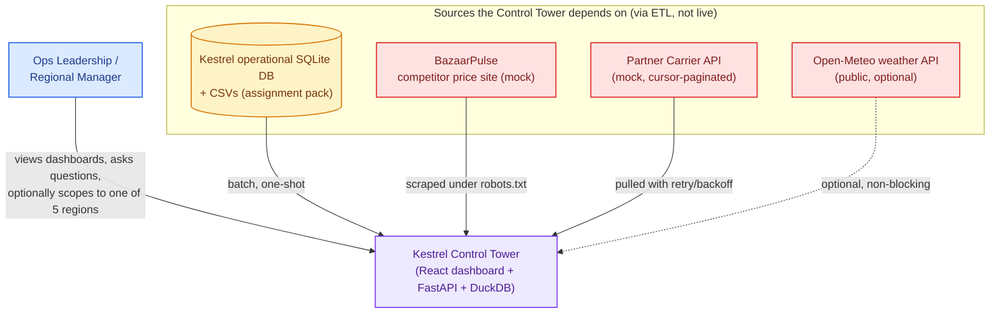
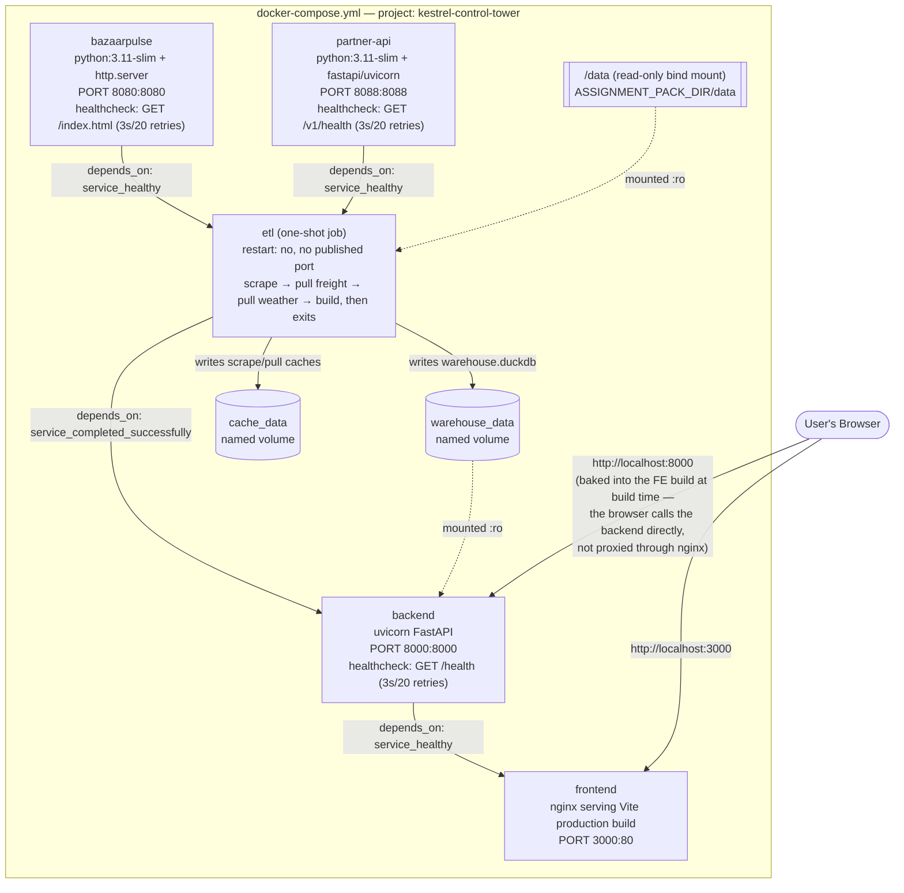
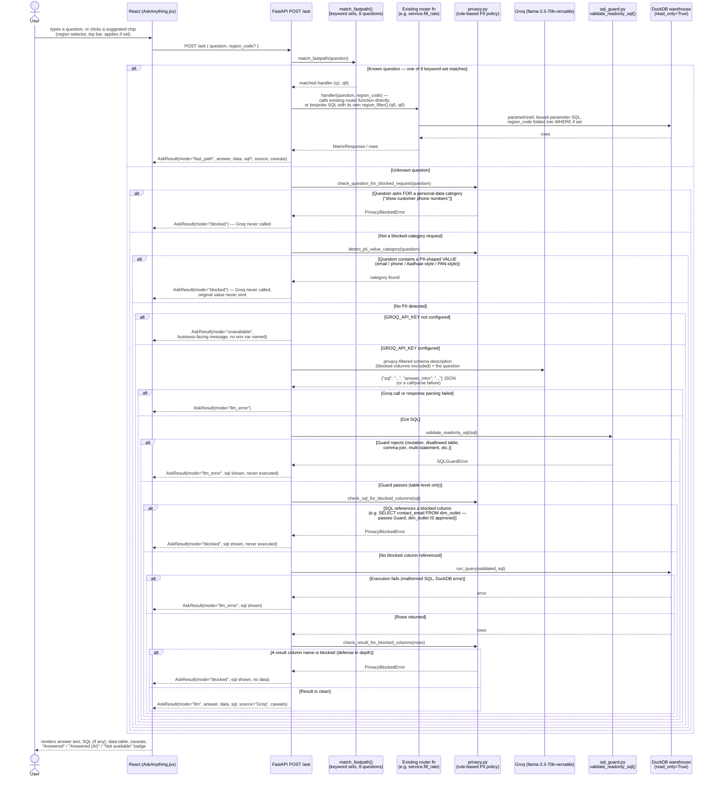
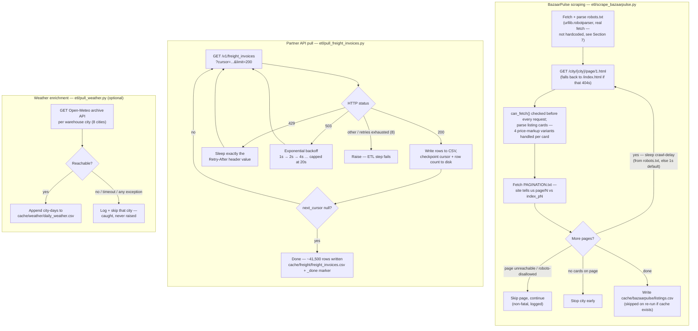
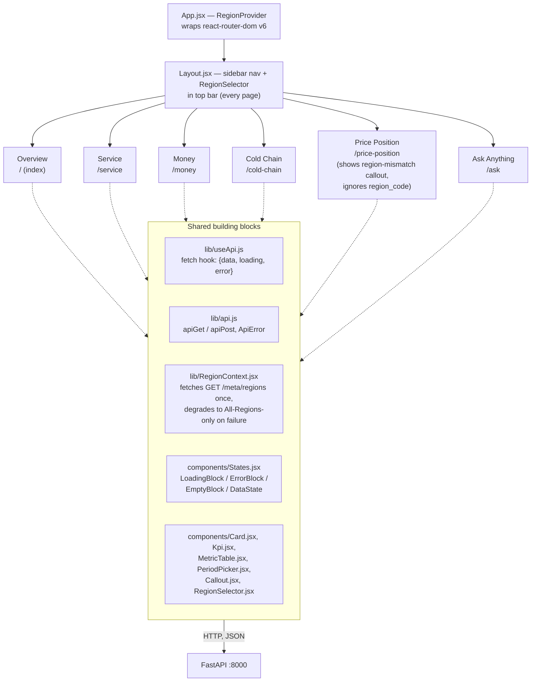
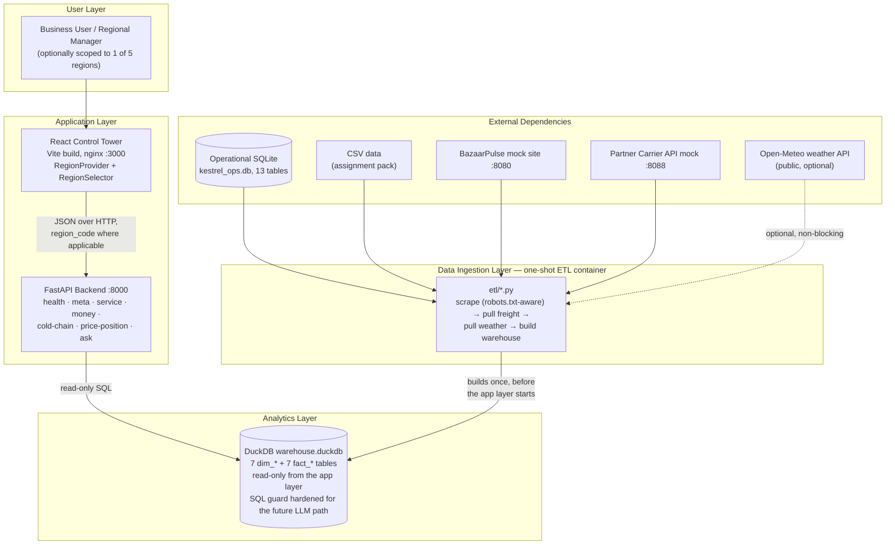

# Kestrel Provisions — Supply Chain Control Tower
## High-Level Design (HLD)

*Source of truth: this document was regenerated by reading the actual repository in full — `docker-compose.yml`, every `Dockerfile`, all seven FastAPI routers (`health`, `service`, `money`, `cold_chain`, `price_position`, `ask`, `meta`), `backend/app/db.py`, `backend/app/sql_guard.py`, `backend/app/query_helpers.py`, `backend/app/date_utils.py`, `etl/build_warehouse.py`, the three ingestion scripts, the full `backend/tests/` suite, `README.md`, and `DECISIONS.md` — on 2026-08-13, after a correction pass that added region scoping, an OTIF-by-outlet fix, a hardened SQL guard, and a real pytest suite. This replaces the prior version of this document, which predated all of that. Nothing below describes a component, endpoint, table, or infrastructure element that isn't present in the code. Where the build stops short of something (the LLM call in Ask Anything, still), that is stated explicitly.*

---

## Architecture in 60 Seconds

Kestrel Provisions is a regional FMCG distributor. The Control Tower is a small, five-container application that gives ops leadership — and now regional managers, scoped to their own region — one place to see where they're losing **service** (fill rate, OTIF) and **money** (freight cost, returns leakage), plus lighter views on cold chain and competitor pricing, and a natural-language question box.

The shape of it: a **React/Vite dashboard** talks to a **FastAPI backend**, which runs **read-only SQL** against a **single-file DuckDB warehouse**. That warehouse is built once, before the app starts, by a **one-shot ETL container** that pulls from five sources — the operational SQLite database, flat CSVs, a mock competitor-pricing website (BazaarPulse, now scraped under a real, fetched `robots.txt` policy), a mock partner freight API (with real cursor pagination, rate-limiting and retries), and the public Open-Meteo weather API (optional) — cleans and reconciles them, and writes seven fact tables and seven dimension tables. The backend and frontend never see raw operational data; the raw schema is physically dropped after the warehouse build.

It is **not a microservices architecture**. It's a small containerized application (5 Docker Compose services) plus a batch pipeline, sized correctly for the problem: a fixed historical dataset (Jan 2025–Jun 2026), read-only analytics, no concurrent-write requirement.

New since the last review: a **region selector** in the top bar lets a regional manager scope Service, Money, Cold Chain, and Ask Anything to one of Kestrel's 5 sales regions (`GET /meta/regions` backs the dropdown). It's a plain `WHERE region_id = ...` filter threaded through the existing endpoints — not authentication, not a new permission system — and it degrades to "All Regions" if `/meta/regions` fails. **Price Position is the deliberate exception**: competitor listings are scraped by city, not by Kestrel sales region, and the two aren't mapped in the data, so that page shows an explicit callout instead of silently ignoring the selector. OTIF also gained `group_by=outlet` (fill rate always had it; this was a parity gap, not a new capability). And the SQL guard that will gate the future LLM path got materially hardened: it now resolves quoted identifiers, comment-obfuscated `FROM`/`JOIN` separators, schema-qualified references, and comma-separated FROM lists (implicit joins, closed in the final release audit) that used to slip past a bareword-only regex — backed by 33 dedicated unit tests.

**Ask Anything** has two tiers, both real. Eight illustrative questions are answered deterministically, in Python, against the same warehouse the dashboard uses — no LLM involved, and they always win even when an LLM key is configured. Anything else is answered by Groq (`GROQ_API_KEY`, default model `llama-3.3-70b-versatile`): the model writes a SQL query against a compact schema description, and that query is validated read-only against the approved analytical views by `sql_guard.py` — the same guard hardened across two audit passes — before it's ever executed. If no key is configured, the API says so (without naming the env var in the response) and keeps working on the 8 fast paths.

Also new: a real `pytest` suite (`backend/tests/`) — SQL-guard unit tests, query-parameter validation regression tests, and integration tests against the live warehouse covering all 8 illustrative questions, OTIF-by-outlet, and every region-filter code path. It isn't wired into any CI pipeline (there isn't one), and it isn't installed in the production Docker image — but it's real, runnable, and it's what caught most of the bugs this correction pass fixed.

---

## Table of Contents

1. [System Context](#1-system-context)
2. [Container / Deployment Architecture](#2-container--deployment-architecture)
3. [End-to-End Data Flow](#3-end-to-end-data-flow)
4. [Analytical Data Model](#4-analytical-data-model)
5. [Ask Anything Architecture](#5-ask-anything-architecture)
6. [External Ingestion](#6-external-ingestion)
7. [Failure / Resilience Architecture](#7-failure--resilience-architecture)
8. [API Architecture](#8-api-architecture)
9. [Frontend Architecture](#9-frontend-architecture)
10. [Data Quality / Business Rules](#10-data-quality--business-rules)
11. [Security / Safety Boundaries](#11-security--safety-boundaries)
12. [Scalability / "What Breaks First"](#12-scalability--what-breaks-first)
13. [Observability / Operations](#13-observability--operations)
14. [Technology Stack](#14-technology-stack)
15. [Architectural Decisions and Trade-offs](#15-architectural-decisions-and-trade-offs)
16. [Final Architecture Overview](#16-final-architecture-overview)

---

## 1. System Context

**Business purpose.** Kestrel's ops leadership had no single place to see service and money problems together; regional managers had no way to see their own slice of it at all. The Control Tower answers, per region or network-wide: *Where are we losing service?* (fill rate, OTIF by outlet/region/warehouse/route), *Where are we losing money?* (freight cost per case, returns as leakage), plus cold chain (temperature excursions, near-expiry stock, cold-chain-linked returns) and competitor price position — and lets anyone type a plain-English question against the same numbers.

**Shape of the system.** Two halves, unchanged in principle from the prior design, with region-scoping now layered into the application half:

- An **application half** — a browser-facing React dashboard, a FastAPI backend, and a DuckDB analytical warehouse — that only ever does read-only queries, now including an optional `region_code` scope on most of them.
- A **batch ingestion half** — a one-shot ETL pipeline that reads the operational SQLite database and CSVs, scrapes/pulls two mock external services (BazaarPulse under a real `robots.txt` policy), optionally enriches with public weather data, and writes the cleaned warehouse the application half reads from.

These halves are strictly sequential: the ETL container must **exit successfully** before the backend container is allowed to start (`depends_on: etl: condition: service_completed_successfully`). This is a batch-then-serve system for a fixed historical dataset (1 Jan 2025 – 30 Jun 2026), not a live feed.

**Scale actually being served.** 511,516 order lines, 724 outlets across **5 sales regions** (`WST`, `STH`, `NTH`, `EST`, `CEN` — confirmed via `backend/tests/test_endpoints.py`), 140 routes, ~41,500 freight invoices, 1,137 BazaarPulse listings, 341 products. Single-tenant, single-region-cluster analytics — the region selector narrows the *view*, it does not partition the system into tenants.

---

## 2. Container / Deployment Architecture

Still **five Docker Compose services**, wiring unchanged from the prior build: this is a small containerized application with a batch pipeline and two mock dependencies, not a microservices architecture — no service mesh, no independent per-service scaling, no inter-service RPC beyond simple HTTP health/data pulls.

Notes:

- `bazaarpulse_site/` and `partner_api/` fixtures are baked into their images at **build** time via Compose `additional_contexts`; only `data/` (95MB SQLite DB + 82MB CSVs) is a runtime bind mount, read fresh by the ETL container each run.
- `cache_data` is ETL-internal scratch, not mounted into `backend` — the backend only ever sees the finished `warehouse_data` volume, read-only.
- The browser talks to the backend **directly** at `:8000`, not via the frontend/nginx container — `VITE_API_BASE_URL` is baked into the static JS bundle at frontend build time.
- Startup ordering is health/completion-gated, not just start-gated: `etl` won't start until both mocks are *healthy*; `backend` won't start until `etl` has *exited 0*; `frontend` won't start until `backend` is *healthy*.
- **New, honest gap carried over from the audit:** all five images run as `root` — no `USER` directive in any `Dockerfile`. Low blast radius here (no untrusted code execution, single-tenant, no exposed write path), but a real hardening item before any multi-tenant deployment (documented in `DECISIONS.md`, "what breaks first in production").
- The backend image installs `backend/requirements.txt` only — `pytest`/`httpx` (`backend/requirements-dev.txt`) are **not** installed in any container. The `backend/tests/` directory is copied into the image (`COPY backend/ ./backend/` copies everything), but nothing in the image can run it — tests run from a developer's machine or CI, not in production.

---

## 3. End-to-End Data Flow

```mermaid
flowchart TB
    RAW["Raw operational data<br/>SQLite kestrel_ops.db (13 tables)<br/>+ CSV caches (freight, BazaarPulse, weather)"]
    ING["Ingestion<br/>connect_raw_sqlite(): loads all 13 SQLite tables<br/>into a DuckDB 'raw' schema via pandas<br/>(no sqlite_scanner extension — offline-safe)"]
    NORM["Normalization<br/>• per-source timestamp parsing (5 source formats)<br/>• all timestamps → Asia/Kolkata (IST)<br/>• CASE/EACH qty_uom → ordered/delivered eaches & cases<br/>• freight amounts: paise → INR"]
    CLEAN["Cleaning<br/>• city canonicalisation (KP-2288)<br/>• outlet dedup by GST / exact lat-long (KP-2211)<br/>• test/migration outlet flagging by name pattern (KP-2377)<br/>• negative return qty → abs() (KP-2402)"]
    ENRICH["Business-rule enrichment<br/>• fiscal-year / fiscal-quarter calc (Apr–Mar, year-ending label)<br/>• ordered_after_discontinued flag<br/>• near-expiry = expiry_date − snapshot_date (not ageing_bucket)<br/>• conservative competitor SKU matching (brand+category+pack)<br/>• region_id denormalized onto fact_returns via dim_outlet"]
    FACTS["Analytical facts & dimensions<br/>7 dim_* + 7 fact_* tables"]
    DUCK[("DuckDB warehouse.duckdb<br/>raw schema physically DROPPED after build")]
    API["FastAPI routers<br/>parametrized, read-only SQL,<br/>optional region_code scope"]
    FE["React / Vite frontend"]

    RAW --> ING --> NORM --> CLEAN --> ENRICH --> FACTS --> DUCK --> API --> FE
```

Each transformation is implemented exactly once, in `etl/build_warehouse.py`:

| Transformation | Where | Why |
|---|---|---|
| Timestamp normalization | `_parse_ts_sql()` — 5 source-specific `strptime` formats for `orders.created_at` and `deliveries.actual_arrival` | Upstream systems write timestamps in different formats |
| Asia/Kolkata operational timezone | Freight timestamps converted UTC→IST at pull time; all business dates treated as IST | The operational DB and everything joined against it is IST |
| City canonicalisation | `CITY_CANONICAL_MAP` (KP-2288) | Free-text `outlets.city` has multiple spellings for the same city |
| Outlet deduplication | `dim_outlet` dedup by GST number or exact lat/long (KP-2211) | Name-based dedup would be fragile; ~6 outlets found duplicated |
| Test/migration outlet exclusion | `TEST_OUTLET_PATTERNS` name-pattern match (KP-2377), flagged not dropped | No status flag exists for this; exactly 3 outlets matched |
| Negative-return normalization | `ABS(r.return_qty)` (KP-2402) | Confirmed sign bug in one upstream feed |
| CASE → EACH conversion | `fact_order_lines.ordered_eaches`/`delivered_eaches` via `case_pack_at_order` | Fill rate is defined in eaches (Section 10) |
| Fiscal-year calculation | `dim_date` + `date_utils.py`: Apr–Mar, year-ending label | Apr–Jun 2026 = **FY2027 Q1** |
| Conservative competitor SKU matching | `build_fact_price_position()`: brand + category + normalised pack size, name-overlap tiebreak | 614 of 1,137 listings match; the rest are `ambiguous`, excluded from price-gap views |
| Near-expiry inventory processing | `fact_inventory_snapshot.days_to_expiry = expiry_date − snapshot_date` | `ageing_bucket` checked and found uncorrelated with actual days-to-expiry |
| Region denormalization onto returns | `build_fact_returns()` now `JOIN dim_outlet o ON o.outlet_id = r.outlet_id`, carries `o.region_id` | Additive-only change so `fact_returns` can be region-scoped the same way `fact_order_lines`/`fact_deliveries` already were — needed for the regional-manager view (Section 5, 8) |

---

## 4. Analytical Data Model

Seven dimension tables and seven fact tables, built once by `etl/build_warehouse.py`. `fact_returns` now carries a denormalized `region_id` (added in this correction pass); `fact_freight` still has no stored region column — its region scope is resolved at **query time** via a `LEFT JOIN dim_route` on `route_code`, not a stored FK.

```mermaid
erDiagram
    dim_outlet ||--o{ fact_order_lines : "outlet_id"
    dim_region ||--o{ fact_order_lines : "region_id"
    dim_route ||--o{ fact_order_lines : "route_id"
    dim_warehouse ||--o{ fact_order_lines : "warehouse_id"
    dim_salesperson ||--o{ fact_order_lines : "salesperson_id"
    dim_product ||--o{ fact_order_lines : "product_id (attrs denormalized)"

    dim_route ||--o{ fact_deliveries : "route_id"
    dim_warehouse ||--o{ fact_deliveries : "warehouse_id"
    dim_outlet ||--o{ fact_deliveries : "outlet_id"
    dim_region ||--o{ fact_deliveries : "region_id"
    fact_order_lines }o--|| fact_deliveries : "order_id (logical, order-grain)"

    dim_outlet ||--o{ fact_returns : "outlet_id"
    dim_region ||--o{ fact_returns : "region_id (denormalized via dim_outlet, added for region scoping)"
    dim_product ||--o{ fact_returns : "product_id (attrs denormalized)"
    fact_order_lines |o--o{ fact_returns : "order_line_id (LEFT JOIN)"

    dim_warehouse ||--o{ fact_inventory_snapshot : "warehouse_id"
    dim_product ||--o{ fact_inventory_snapshot : "product_id (attrs denormalized)"

    dim_warehouse |o--o{ fact_freight : "warehouse_code (LEFT JOIN, may be null)"
    dim_route |o--o{ fact_freight : "route_code (LEFT JOIN, may be null; also the ONLY path to a region — resolved at query time, not stored)"

    dim_product |o--o{ fact_price_position : "sku_code (only when match_confidence='matched')"

    dim_outlet {
        bigint outlet_id PK
        varchar outlet_code
        varchar city_canonical
        bool is_test_outlet
        bool is_duplicate_outlet
        bool include_by_default
    }
    dim_product {
        bigint product_id PK
        varchar sku_code
        varchar brand
        varchar category
        bool is_chilled
        bool is_discontinued
        date discontinued_date
    }
    dim_region {
        bigint region_id PK
        varchar region_code
        varchar region_name
        varchar regional_manager
        varchar status
    }
    dim_warehouse {
        bigint warehouse_id PK
    }
    dim_route {
        bigint route_id PK
        bigint region_id FK
    }
    dim_salesperson {
        bigint salesperson_id PK
    }
    dim_date {
        date date PK
        int fiscal_year
        int fiscal_quarter
    }

    fact_order_lines {
        bigint order_line_id PK
        bigint ordered_eaches
        bigint delivered_eaches
        bool ordered_after_discontinued
        varchar order_status
    }
    fact_deliveries {
        bigint delivery_id PK
        bigint outlet_id
        int delay_minutes
        bool temperature_excursion_flag
    }
    fact_returns {
        bigint return_id PK
        bigint region_id
        bigint return_eaches
        varchar return_reason_code
    }
    fact_inventory_snapshot {
        bigint snapshot_id PK
        int days_to_expiry
        int on_hand_cases
    }
    fact_freight {
        varchar invoice_id PK
        double amount_inr
    }
    fact_price_position {
        varchar listing_id PK
        varchar city
        varchar match_confidence
        double mrp_gap_pct
    }
    fact_weather {
        varchar city
        date date
    }
```

**Things worth calling out:**

- **`dim_region.regional_manager`** is a real column in the source data (`raw.regions`), carried straight through to `dim_region` unchanged. `GET /meta/regions` surfaces it so the region dropdown can show "West — [Manager Name]" — that's the entire "regional-manager view" implementation; there is no per-manager login or credential.
- **`fact_price_position.city`** is the only geographic key on competitor data — there is no `region_id` on this table, and none was added, because the source data has no city→region mapping. This is why Price Position is excluded from region scoping (Section 8), not an oversight.
- **`dim_date`** and **`fact_weather`** remain built but unused by any current router — same as before this correction pass — and remain in the LLM path's table allowlist for if/when a free-form question needs them.

### Which tables power which feature

| Feature | Endpoint(s) | Tables involved |
|---|---|---|
| Fill Rate | `GET /service/fill-rate` | `fact_order_lines` + `dim_outlet`/`dim_region`/`dim_warehouse`/`dim_route`; optional `region_code` via `ol.region_id` |
| OTIF (region/warehouse/route/**outlet**) | `GET /service/otif` | `fact_order_lines` (order-grain aggregate) joined to `fact_deliveries`, + `dim_region`/`dim_warehouse`/`dim_route`/`dim_outlet`; optional `region_code` via `d.region_id` |
| Freight | `GET /money/freight-cost-per-case` | `fact_freight` (region via `LEFT JOIN dim_route`) + `dim_warehouse`, plus `fact_order_lines` for the delivered-cases denominator |
| Returns | `GET /money/returns-leakage` | `fact_returns` (now has `region_id`), plus `fact_order_lines` for the dispatch-value denominator |
| Cold Chain | `GET /cold-chain/excursions`, `/cold-chain/returns` | `fact_deliveries` + `fact_order_lines` (excursions, region via `d.region_id`); `fact_returns` filtered to `RT01_NEAR_EXPIRY`/`RT06_COLD_CHAIN_BREACH` (returns, region via `region_id`) |
| Near Expiry | `GET /cold-chain/near-expiry` | `fact_inventory_snapshot` + `dim_warehouse`; region via `w.region_id` (only joined when `group_by=warehouse`, `warehouse_code`, or `region_code` is given) |
| Price Position | `GET /price-position/gap`, `/price-position/summary` | `fact_price_position` + `dim_product` + `fact_order_lines`; **city-scoped only, no region_code param** |
| Ask Anything | `POST /ask` | Reuses the same router functions for 6 of 8 fast paths (region-aware); 2 fast paths (`q5`, `q8`) use bespoke SQL with their own `region_filter()` call. A future LLM path is allowlisted against **all 14** dim/fact tables. |
| Regional-manager scope | `GET /meta/regions` | `dim_region` only |

---

## 5. Ask Anything Architecture

Two tiers. The 8 fast paths are unchanged in structure from the prior design and region-aware; the LLM fallback, previously a contract-only stub, is now a real, working path (Groq).

**What's real today:**

- The **8 illustrative questions** are matched by simple keyword-set matching (`_FASTPATH_HANDLERS` in `backend/app/routers/ask.py`) — not NLP, not an LLM — and **always take priority** over the LLM path, even when a Groq key is configured. Every handler accepts `region_code` and threads it into its underlying query via `query_helpers.region_filter()`; when `region_code` is set, the answer text says so (`_region_note()`) so the scoping is never silent.
- **One handler is explicitly exempt**: `_q6_price_gap_top_skus` (competitor pricing, fixed to Mumbai) appends a caveat rather than applying `region_code` — same city-vs-region gap as the dedicated Price Position page (Section 4, 8).
- **The Groq fallback is now implemented, not just contracted.** `_generate_sql_with_groq()` sends the model a compact, hand-written schema description — table and column names only, no live data, and nothing from the raw operational tables (which don't exist in the warehouse file at all — Section 3) — plus the user's question, and asks for `{"sql": ..., "answer_intro": ...}` JSON. Two `assert`s at import time check the schema description against the live system: every table named is a subset of `db.ALLOWED_TABLES`, and no column named is one of `privacy.ALL_BLOCKED_COLUMNS` — so the description shown to the model can never drift ahead of either the SQL guard's table allowlist or the privacy policy's column blocklist.
- **Rule-based personal-data protection (`backend/app/privacy.py`) — new, deterministic, no LLM involved in the detection itself.** Four layers: (1) schema filtering, above; (2) question-level blocking, both a fixed-phrase check for requests *for* a personal-data category and a regex check for a PII-shaped *value* embedded in the question, both running before Groq is ever called; (3) SQL-level blocking after the guard passes, since the guard only checks table names and `SELECT contact_email FROM dim_outlet` would otherwise pass it (`dim_outlet` is an approved table); (4) result-level blocking as a final check on actual column names returned. See Section 11 for the full column list and DECISIONS.md "Personal data protection" for the design rationale.
- **`sql_guard.validate_readonly_sql()`** — the same guard hardened across two audit passes (Section 7 and 11) — is applied to *every* piece of LLM-generated SQL before it can reach the database, with no exceptions; the privacy layer runs in addition to it, not instead of it. Region scoping for free-form questions is a prompt instruction to the model, not a structural guarantee like the fast paths; the UI states this caveat when a region is selected.
- Five distinct failure/block points — the Groq call/response itself, the guard, SQL-level privacy, execution, and result-level privacy — each degrade to a clean, generic message and no data, never a 500 and never a leaked value.
- **`GET /ask/supported-questions`** lets the frontend render the 8 example questions as clickable chips.
- **`GET /health`'s `llm_configured` field** now reflects `GROQ_API_KEY`, not `ANTHROPIC_API_KEY` — it tracks whether the free-form path is actually usable.

---

## 6. External Ingestion

Resilience mechanisms, by source:

| Mechanism | BazaarPulse | Partner API | Weather |
|---|---|---|---|
| Pagination style | Path-based, per-city convention discovered from `PAGINATION.txt` | Cursor-based (`next_cursor`, 200/page) | N/A (one request per city) |
| Robots compliance | **Real** `robots.txt` fetch + parse (`urllib.robotparser`) every run; `can_fetch()` gates every request; crawl-delay read from the policy, falling back to a hardcoded 1s only if `robots.txt` itself can't be fetched | N/A | N/A |
| Retry on transient failure | Unreachable/disallowed pages skipped, city continues | Up to 8 attempts per page | No retry — non-critical, skipped |
| 429 handling | N/A (no rate limiting on the static site) | Sleeps the exact `Retry-After` header value, then retries | N/A |
| 503 handling | N/A | Exponential backoff (1s→2s→4s…cap 20s), then retries | Caught as a generic unreachable case |
| Caching / idempotency | `cache/bazaarpulse/listings.csv` — skipped on re-run unless `--refresh` | `_checkpoint.json` (cursor + rows written) after **every page**, resumable; `_done` marker | `cache/weather/daily_weather.csv` — skipped on re-run unless `--refresh` |
| Non-blocking failure | Per-city `try/except`; other cities still scraped | N/A — load-bearing, fails the ETL step if retries exhaust | Explicitly optional; degrades to an empty cache rather than failing |

The mock Partner API **deliberately injects** slow first-page latency, ~1-in-9 429s, and ~1-in-25 503s on every request, exercised on every ETL run.

---

## 7. Failure / Resilience Architecture

```mermaid
flowchart TB
    F1["BazaarPulse<br/>unavailable"] --> F1R["Per-city try/except —<br/>logs and continues other cities.<br/>fact_price_position built empty-schema<br/>if no cache at all. App still starts."]

    F2["robots.txt disallows<br/>a specific URL"] --> F2R["fetch() raises RobotsDisallowedError,<br/>caught by try_fetch() → logged, that URL<br/>skipped, scraping continues.<br/>NEW in this pass — real enforcement,<br/>not a docstring claim."]

    F3["Partner API<br/>returns 429 / 503"] --> F3R["429: sleeps exact Retry-After, retries.<br/>503: exponential backoff (1s→20s cap),<br/>up to 8 attempts, then raises —<br/>FAILS THE ETL STEP if exhausted."]

    F4["Weather API<br/>unavailable"] --> F4R["Caught per-city, logged, empty cache<br/>written. NON-BLOCKING."]

    F5["ETL step fails"] --> F5R["backend has depends_on: etl condition<br/>service_completed_successfully —<br/>backend container never starts.<br/>FAILS THE PIPELINE, by design."]

    F6["Warehouse file<br/>not found / not yet built"] --> F6R["get_connection() raises<br/>HTTPException 503 with the exact<br/>ETL commands to run."]

    F7["Backend query raises<br/>(bad SQL, DuckDB error)"] --> F7R["run_query() catches duckdb.Error,<br/>raises HTTPException 500.<br/>Request-scoped, not a process crash."]

    F8["Invalid region_code<br/>(unknown code, e.g. typo)"] --> F8R["region_filter()'s scalar subquery<br/>resolves to NULL; region_id = NULL is<br/>false for every row → empty result set,<br/>not an error. Same pattern as an<br/>unmatched warehouse_code filter."]

    F9["GROQ_API_KEY<br/>absent"] --> F9R["ask.py: unmatched question returns<br/>mode='unavailable', no env var named<br/>in the response. NEVER a 500."]

    F10a["Groq call fails, or its response<br/>isn't the expected JSON shape"] --> F10aR["GroqCallError caught in ask.py →<br/>mode='llm_error'. NEVER a 500."]

    F10["LLM-generated SQL invalid<br/>(mutation keyword, multi-statement,<br/>disallowed table, comma-join)"] --> F10R["sql_guard.validate_readonly_sql()<br/>raises SQLGuardError before execution →<br/>mode='llm_error', SQL shown, never run."]

    F10b["LLM-generated SQL passes the guard<br/>but is malformed / fails at DuckDB"] --> F10bR["run_query() raises, caught in ask.py →<br/>mode='llm_error'. NEVER a 500."]

    F11["SQL references a non-allowlisted<br/>table — bare, quoted, schema-qualified,<br/>comment-obfuscated, or comma-joined"] --> F11R["Hardened table-reference regex resolves<br/>all forms and un-quotes identifiers<br/>before the ALLOWED_TABLES check;<br/>a CTE alias never exempts a<br/>schema-qualified reference to the same name;<br/>comma-separated FROM lists rejected outright.<br/>33 unit tests in test_sql_guard.py."]
```

**Summary of disposition by failure:**

| Failure | Retried | Cached / idempotent | Gracefully degraded | Fails the pipeline |
|---|:-:|:-:|:-:|:-:|
| BazaarPulse unavailable | — | ✓ (per-city cache) | ✓ | — |
| robots.txt disallows a URL | — | — | ✓ (URL skipped) | — |
| Partner API 429 | ✓ | — | — | — |
| Partner API 503 | ✓ (then fails if exhausted) | ✓ (resumable checkpoint) | — | ✓ (if retries exhaust) |
| Weather unreachable | — | ✓ | ✓ | — |
| ETL step fails | — | — | — | ✓ (backend blocked) |
| Warehouse missing at query time | — | — | ✓ (503 with guidance) | — |
| Backend query error | — | — | ✓ (500, request-scoped) | — |
| Invalid/unknown region_code | — | — | ✓ (empty result, not an error) | — |
| Groq key absent | — | — | ✓ (`unavailable` mode) | — |
| Groq call fails / bad response shape | — | — | ✓ (`llm_error` mode) | — |
| LLM SQL invalid / disallowed table (any quoting form) | — | — | ✓ (guard rejects before execution → `llm_error`) | — |
| LLM SQL passes guard but fails at execution | — | — | ✓ (`llm_error` mode) | — |

---

## 8. API Architecture

Single FastAPI app (`backend/app/main.py`), **seven** routers, all read-only. CORS restricted to `CORS_ORIGINS` (Compose sets `http://localhost:3000`).

### Health

| Endpoint | Params | Purpose |
|---|---|---|
| `GET /health` | — | `status`, warehouse presence/path, table list, `llm_configured`. Backend's Docker healthcheck target. |

### Meta

| Endpoint | Params | Purpose |
|---|---|---|
| `GET /meta/regions` | — | The 5 active regions (`region_code`, `region_name`, `regional_manager`) from `dim_region WHERE status = 'ACTIVE'`. Backs the region selector — the frontend fetches real codes rather than hardcoding them. |

### Service (`/service`)

| Endpoint | Key params | Purpose |
|---|---|---|
| `GET /service/fill-rate` | `group_by` (outlet\|region\|warehouse\|route), `fiscal_year` (`ge=2000,le=2100`) + `fiscal_quarter` (`ge=1,le=4`) or `month`, `region_code`, exclude-outlet flags, `order`, `limit` | Fill rate **in eaches** (locked, no cases toggle), scoped to `DELIVERED`/`PARTIAL` orders, optionally to one region |
| `GET /service/otif` | `group_by` (region\|warehouse\|route\|**outlet**), period params, `region_code`, `on_time_threshold_minutes`, `order`, `limit` | Strict OTIF, now including outlet as a grouping (parity fix — same strict, no-tolerance definition) |

### Money (`/money`)

| Endpoint | Key params | Purpose |
|---|---|---|
| `GET /money/freight-cost-per-case` | `group_by` (warehouse\|carrier), period params, `region_code`, `limit` | Freight ₹/delivered case; region resolved via the delivering route's region (`dim_route.region_id`), independently of the order-side region filter — same "filtered independently, not reconciled" caveat as the period filter |
| `GET /money/returns-leakage` | `group_by` (category\|carrier), period params, `region_code`, `limit` | Returns value and leading reason by category; `carrier` grouping returns an explicit empty result (no carrier-return linkage in the data) |

### Cold Chain (`/cold-chain`)

| Endpoint | Key params | Purpose |
|---|---|---|
| `GET /cold-chain/excursions` | period params, `region_code` | Temperature-excursion rate per hundred chilled deliveries, by month |
| `GET /cold-chain/returns` | period params, `region_code`, `limit` | Returns tagged `RT01_NEAR_EXPIRY`/`RT06_COLD_CHAIN_BREACH`, by category |
| `GET /cold-chain/near-expiry` | `group_by` (`Literal["category","warehouse"]` — now rejects bad input with 422 instead of silently defaulting), `near_expiry_days` (`ge=1,le=365`), `warehouse_code`, `region_code` | Point-in-time stock nearing expiry, as of the **latest** snapshot |

### Price Position (`/price-position`) — no region_code, by design

| Endpoint | Key params | Purpose |
|---|---|---|
| `GET /price-position/gap` | `city`, `top_n_skus_by_value` | Kestrel MRP vs. lowest confidently-matched competitor price, for top SKUs by dispatch value |
| `GET /price-position/summary` | `city`, `category` | Average/min/max MRP gap %, by category, matched listings only |

**This is the one deliberate exception to region scoping**, called out both in the API (no `region_code` parameter exists on either endpoint) and in the UI (Section 9): competitor listings are scraped by city, not mapped to Kestrel's own 5 sales regions in this dataset, so pretending to filter by region would silently show wrong data rather than fail loudly.

### Ask Anything (`/ask`)

| Endpoint | Key params | Purpose |
|---|---|---|
| `GET /ask/supported-questions` | — | Lists the 8 fast-path questions |
| `POST /ask` | body: `{question: string (3–500 chars), region_code?: string}` | Answers via fast path (region-aware for 7 of 8; `q6` is exempt, see Section 5); otherwise via Groq + `sql_guard`, or `unavailable`/`llm_error` |

**Not documented here because they do not exist:** any write endpoints, any auth endpoints, any endpoint outside these seven routers, any endpoint touching the raw operational schema (dropped after the warehouse build).

---

## 9. Frontend Architecture

- **`RegionProvider`** (`lib/RegionContext.jsx`) wraps the whole app in `App.jsx`, fetches `GET /meta/regions` once on mount, and exposes `{regionCode, setRegionCode, regions, regionsLoading}` via context. Default is `""` (All Regions). If the fetch fails, `regions` stays empty and the selector effectively degrades to "All Regions only" — every page still works.
- **`RegionSelector`** renders in `Layout.jsx`'s top bar on every page, so the active scope is never hidden state. Its `<select>` shows "Region Name — Manager Name" per option, sourced live from `/meta/regions`, not hardcoded.
- Every page that supports region scoping (`Service`, `Money`, `ColdChain`, `AskAnything`, `Overview`) reads `regionCode` via `useRegion()` and folds it into its `useApi()` query string or `apiPost()` body.
- **`PricePosition.jsx`** is the deliberate exception: it reads `regionCode` only to decide whether to show a `Callout variant="warn"` explaining that the region selector doesn't apply on this page (city-based scraping vs. region-based sales data) — it never sends `region_code` to either price-position endpoint, because those endpoints don't accept one.
- Every page shares one `useApi()` hook and one `<DataState>` wrapper for loading/error/empty handling.
- Build-time only: `VITE_API_BASE_URL` is compiled into the static JS bundle by `frontend/Dockerfile`, then served by nginx as static files.

---

## 10. Data Quality / Business Rules

Classified as **business definition** (reflects how Kestrel wants the number defined), **data-quality finding** (something true about the data, investigated and reported as-is), or **engineering assumption** (a judgement call in the absence of a documented rule).

| Rule | Classification | Detail |
|---|---|---|
| Fill Rate = eaches only, no cases toggle | **Business definition** | Rakesh Menon's follow-up overrides the brief's "case fill rate": modern trade penalises units short, not cases short. Applied uniformly. |
| OTIF "in-full" = strict 100%, no tolerance | **Business definition** (textbook default, pending Kestrel's own policy) | No documented shrinkage-tolerance policy exists; the strict definition was applied deliberately rather than picking a threshold to make the number "look normal." |
| OTIF reads near-zero almost everywhere | **Data-quality finding** | 0 of 511,516 order lines ever reach `delivered_eaches >= ordered_eaches`; 99th percentile of order-level fulfilment is 94.8%. `avg_fulfilment_pct` reported alongside as the actionable signal. |
| **OTIF now supports `group_by=outlet`** | **Engineering correction, not a new business rule** | The brief asked for both metrics "by region, by warehouse, by route, by outlet"; fill rate always had all four, OTIF was missing outlet — an oversight, caught in audit (`fact_deliveries` already carried `outlet_id`). The strict, no-tolerance definition is unchanged. |
| `delay_minutes` used as-is, not recomputed from timestamps | **Engineering assumption**, informed by a data-quality finding | `delay_minutes` disagrees with `actual_arrival − planned_arrival` in 87% of deliveries, including sign. The documented field's own sign convention was trusted over a derivation the data itself doesn't corroborate. |
| Kestrel fiscal year = April–March, year-ending label (Apr–Jun 2026 = **FY2027 Q1**) | **Business definition** | Standard Indian corporate convention, explicitly requested; verified across all quarters. |
| Negative return quantities → `abs()` | **Data-quality finding**, resolved by **engineering assumption** | KP-2402: one upstream feed has a sign bug on `return_qty`. Treated as a bug, not a reversal signal. |
| Test/migration outlets excluded by default | **Engineering assumption** | No status flag exists (KP-2377) — name-pattern heuristic, matching exactly 3 outlets. |
| Outlet dedup by GST number / exact geo, not name | **Engineering assumption** | Name-based dedup would be fragile at 724 outlets; found ~6 duplicates (KP-2211), not "hundreds." |
| Competitor SKU matching is conservative | **Engineering assumption** | Matched on (brand, category, normalised pack size) with a name-overlap tiebreak; **not** loosened when the ambiguous rate (~46%) turned out higher than hoped. |
| Unmatched/ambiguous competitor records are never guessed | **Engineering assumption** (design boundary) | Every price-position endpoint filters to `match_confidence = 'matched'`. |
| **Regional-manager view is a scope filter, not authentication** | **Product/engineering decision** | The brief asked to "make it work for regional managers too" — implemented as a `region_code` `WHERE` filter, default All Regions, no accounts/roles/permissions. Anyone can switch region; it only narrows what's shown, consistent with the rest of this being a single-tenant tool. |
| **Price Position is excluded from region scoping** | **Data-quality finding, surfaced as a UI/API boundary** | Competitor listings are scraped by city (Mumbai/Delhi/Bengaluru/Chennai); Kestrel's 5 sales regions have no mapping to those cities in this dataset. Rather than fabricate one, the page shows an explicit callout and the API accepts no `region_code` param on either price-position endpoint. |
| Discontinued-SKU ordering reported as a systemic finding | **Data-quality finding** | All 721 production outlets (724 total, excluding the 3 known test/migration outlets — same `is_test_outlet` rule fill_rate/otif already apply) have at least one order line for a discontinued SKU after its discontinuation date, across 24 SKUs. Test/migration outlets excluded from this finding in the final release review — they were previously included and topped the drill-down table. |
| Network-wide lateness reported as systemic | **Data-quality finding** | All 140 routes exceed "more than 1 in 10 deliveries over 2 hours late," average delay ~132 minutes network-wide. |
| Near-expiry computed from `expiry_date − snapshot_date`, not `ageing_bucket` | **Data-quality finding** | `ageing_bucket` checked and found uncorrelated with actual days-to-expiry. |
| Orders scoped to `DELIVERED`/`PARTIAL` for fill-rate/OTIF | **Engineering assumption** | `CANCELLED`/still-`OPEN` orders excluded as a deliberate choice, not a brief requirement. |

---

## 11. Security / Safety Boundaries

Only what actually exists.

- **Secrets via environment variables only.** `ASSIGNMENT_PACK_DIR`, `GROQ_API_KEY`, `GROQ_MODEL`, `KESTREL_DB_PATH`, `WAREHOUSE_DB_PATH`, `PARTNER_API_KEY`, `CORS_ORIGINS` all read from the environment; none hardcoded in application logic (one low-risk exception: `PARTNER_API_KEY`'s fallback default in `etl/config.py` is a fixture key for the assignment's own mock API). `ANTHROPIC_API_KEY`/`ANTHROPIC_MODEL` remain readable for compatibility with earlier docs but are not called by any code path.
- **`.env` is git-ignored**, along with `/data/`, `*.db`, `/cache/`, `/warehouse/*.duckdb*`.
- **Read-only analytical querying, enforced at the connection level.** `get_connection()` always opens DuckDB with `read_only=True`; the backend container also mounts `warehouse_data` as `:ro`.
- **No raw-table access from any code path.** `build_warehouse.py` runs `DROP SCHEMA raw CASCADE` — the raw operational tables physically do not exist in the file the backend opens.
- **Hardened SQL allowlisting — the correction pass's biggest security change, hardened again in the final release audit.** `sql_guard.validate_readonly_sql()` gates any SQL not built by hand-written, parametrized backend code — that's exactly the LLM path (Section 5), and every piece of Groq-generated SQL goes through this guard with no exceptions before it can touch the database. Across both audit passes, four bypasses have been found and closed:
  - **Quoted-identifier bypass (the original bug).** The old table-reference regex only matched bareword identifiers after `FROM`/`JOIN`; `FROM "information_schema"."tables"` was invisible to it and passed straight through. The new regex (`_TABLE_REF_RE`) resolves bare, quoted (`"..."`, with `""`-escaped internal quotes), and schema-qualified references in any combination, then un-quotes them before the `ALLOWED_TABLES` check.
  - **Comment-obfuscated separators.** `FROM/**/information_schema.tables` is valid SQL — a real lexer treats a block comment as whitespace. The guard's separator pattern (`_SEP`) now matches "whitespace or a `/* ... */` block comment" as one unit, so this can't slip past a naive `\s+`-based check.
  - **CTE-alias collision.** A schema-qualified reference (`information_schema.tables`) is **never** exempted by a CTE alias of the same bare name (`WITH tables AS (...)`), because CTEs can't be schema-prefixed in DuckDB — closing a path where a disallowed table could be smuggled past the allowlist by naming a CTE the same thing.
  - **Comma-separated FROM list (implicit join), found in the final release audit.** `_TABLE_REF_RE` only matched identifiers following a `FROM`/`JOIN` keyword; a second table introduced by a bare comma (`FROM dim_outlet, information_schema.tables`) was invisible to it and passed through untouched. Closed by rejecting comma-separated FROM lists outright (`_COMMA_TABLE_LIST_RE`) — every fast-path query in this app already uses explicit `JOIN` syntax, so this has no effect on approved queries.
  - **Mutation keywords blocked**, unchanged: `INSERT`/`UPDATE`/`DELETE`/`DROP`/`ALTER`/`ATTACH`/`DETACH`/`CREATE`/`PRAGMA`/`COPY`/`EXPORT`/`IMPORT`/`CALL`/`INSTALL`/`LOAD`/`VACUUM`/`CHECKPOINT`/`GRANT`. Only a single `SELECT`/`WITH` statement is allowed; `;`-separated multi-statements are rejected; a `LIMIT 500` is appended if missing.
  - **Test coverage:** 33 unit tests in `backend/tests/test_sql_guard.py` — allowed queries, bare/quoted/schema-qualified disallowed tables (including the exact audit bypass examples), JOIN-side disallowed tables, comma-separated FROM lists, every mutation keyword, and SQL-injection-shaped inputs (stacked statements, comment-truncation, `UNION`-based exfiltration attempts, comment-obfuscated `UNION`).
- **`group_by` injection surface closed via `Literal` types everywhere, including the endpoint that used to be the exception.** `cold_chain.near_expiry`'s `group_by` was previously a bare `str` with a silent fallback to `"category"` on bad input — fixed in this pass to `Literal["category", "warehouse"]`, matching every other `group_by` param's fail-closed (422) behaviour. Regression-tested in `test_validation.py`.
- **`fiscal_quarter` and `fiscal_year` both bounds-checked.** `fiscal_quarter: Query(None, ge=1, le=4)` (fixed in an earlier pass) and `fiscal_year: Query(None, ge=2000, le=2100)` (fixed in this pass, after `fiscal_year=0`/negative/`99999` was found to hit an unhandled `ValueError` from Python's `date()` constructor) — both now return a clean 422 instead of a bare 500, across all six affected endpoints.
- **`near_expiry_days` bounds-checked**, `Query(30, ge=1, le=365)` — previously unbounded.
- **`region_code` is a scoping filter, not an authorization boundary.** An unrecognized code resolves to `NULL` via a scalar subquery against `dim_region`, which matches no rows — an empty result, not an error, not a way to bypass anything (there's nothing to bypass; there's no per-region access control, only a per-region *view*).
- **API key optionality is a first-class behaviour.** `GROQ_API_KEY` empty is the default; `GET /health` reports `llm_configured: bool`; `POST /ask` never 500s regardless of key presence, and its user-facing "unavailable"/"llm_error" messages never name the env var.
- **Rule-based personal-data protection (`backend/app/privacy.py`) — new, deterministic, no LLM used to detect PII.** sql_guard.py allowlists tables, not columns, so an approved table's personal-data columns aren't covered by it; this closes that gap for the LLM path specifically (the fast paths never touch these columns at all, by construction — they're hand-written queries against a fixed set of columns). The actual personal-data-bearing columns, found by inspecting the raw schema and the live `warehouse.duckdb` (not invented):
  - `dim_outlet`: `contact_name`, `contact_phone`, `contact_email` (the outlet's contact person), `gst_number` (government tax ID)
  - `dim_salesperson`: `full_name`
  - `dim_warehouse`: `manager_name`
  - `dim_region`: `regional_manager` (also legitimately shown in the region-selector UI via `GET /meta/regions` — a separate, fixed, brief-driven feature; blocking it from the LLM path doesn't affect that endpoint)

  Everything else the app runs on — `outlet_code`, `route_code`, `warehouse_code`, `sku_code`, `region_code`, and the rest of the operational identifiers — is explicitly not personal data and stays available. Four layers, all before/around the SQL guard, not replacing it: schema filtering (blocked columns excluded from what Groq is even told exists, `assert`-checked at import time), question-level blocking (a fixed-phrase check for a request *for* a personal-data category, a regex check for an embedded PII-shaped *value* — email, phone, Aadhaar-style, PAN-style — both before Groq is ever called), SQL-level blocking (a word-boundary scan for a blocked column name in the guard-passed SQL, since the guard's table-level allowlist doesn't cover this), and result-level blocking (a final check on actual returned column names). Any hit returns `mode="blocked"` with a fixed generic message and logs only a safe reason token, never the question text or a detected value. **Defense in depth, not a claim of impossibility** — the regexes are heuristic (a bare 10-digit number can false-positive as a phone number; accepted, since over-blocking fails safe) and the SQL-level check is a text scan, not a real SQL parser. 53 unit/integration tests in `backend/tests/test_privacy.py` and `backend/tests/test_ask_llm.py`.
- **What does *not* exist, explicitly:** no authentication, no authorization/RBAC, no OAuth, no API keys required to call the Control Tower's own API, no WAF, no rate limiting, no per-user or per-region data isolation (the region selector is a client-side convenience, not a server-enforced boundary — a client could request any region's data by passing any `region_code`, which is fine because there's no notion of "a user's own region" to protect in the first place). All five Docker images run as `root` (no `USER` directive) — a real hardening gap before any multi-tenant deployment, low blast radius today.

---

## 12. Scalability / "What Breaks First"

**Current architecture, plainly stated:** a single DuckDB file, opened read-only per request, behind a synchronous FastAPI app, fed by a single-threaded batch ETL job that runs once before the app starts. Correct and low-complexity for the workload it serves — a fixed ~1.5-year historical dataset, read-only analytics, no concurrent-write requirement.

**At 10× data volume (≈5M order lines, ~7,000 outlets):**
- `fill_rate`/`otif`/`returns_leakage`'s full-table-scan-and-aggregate pattern gets proportionally slower — DuckDB's columnar engine scales reasonably well single-query, but there's no pre-aggregation or indexing layer, so every request re-scans from source rows.
- `build_warehouse.py` loads full tables into pandas DataFrames via `sqlite3` before registering them in DuckDB — a real memory/time cost during the one-shot ETL run at 10×, gating how long `docker compose up` takes to reach a healthy backend.
- BazaarPulse/Partner API pulls are already rate-limited/paced by design (1s crawl-delay from robots.txt; server-side 429/503 injection) — 10× data scales ETL wall-clock time roughly linearly.

**With concurrent users:**
- Each request opens its own read-only DuckDB connection — DuckDB supports concurrent read-only connections to the same file, and FastAPI's worker threadpool makes this work today without a connection pool.
- **No rate limiting anywhere** — a burst of concurrent heavy analytical queries competes for the same underlying file I/O with no fairness or backpressure mechanism.
- The region selector doesn't change this story: it narrows result sets (helping query cost slightly), it does not add per-tenant isolation or its own contention.

**With larger ETL jobs:** the pipeline is single-threaded and strictly sequential. A 10× freight invoice walk extends linearly (checkpointing makes it *resumable*, not *faster*). No parallelism across ETL stages or within `build_warehouse.py`'s table-by-table build.

**With more external API data:** BazaarPulse/Partner API growth scales ETL wall-clock time linearly; both are already resilient to the mocks' injected failures (Section 6). Weather is bounded by city-count × day-count.

**With more NL-to-SQL questions:** the 8 fast paths are free (no LLM cost, no latency, no hallucination risk) and scale by adding more Python handlers. Genuinely open-ended questions now go to Groq — real and working, but each one is a network round trip plus a `sql_guard` pass, and correctness depends on the model's generated SQL rather than a tested, hand-written query — the SQL is always shown so a user can verify it, but it is not guaranteed correct the way the fast paths are. No response caching exists yet, so repeated identical free-form questions each cost a fresh Groq call.

**Current, real limitations (from `DECISIONS.md`'s own updated assessment):**
- Single-file DuckDB, no concurrent-write story.
- No authentication or rate limiting on the API.
- Batch ETL, not incremental.
- Competitor matching deliberately conservative — ~46% of listings excluded from price views.
- Known data-quality issues (OTIF near-zero, `delay_minutes` vs. timestamps disagreeing 87% of the time) are reported, not resolved.
- Free-form Ask Anything correctness depends on Groq's generated SQL, not a tested query — the SQL is shown for verification, but is not guaranteed correct the way the 8 fast paths are.
- **All five Docker images run as root** — standard hardening gap, low blast radius single-tenant, real before multi-tenant use.
- **No structured server-side logging beyond uvicorn's default stderr** — fine for a take-home, not for debugging a production incident; would want request logging with correlation IDs and query text on 500s.
- **No CI pipeline** — the real pytest suite (Section 13) exists but nothing runs it automatically on push/PR today.

**FUTURE improvements — explicitly not current architecture:**
- Small connection pool if concurrency needs exceed threadpool-backed read-only connections (already anticipated in `db.py`'s own comments).
- Pre-aggregate or materialize the heaviest views instead of scanning `fact_order_lines` per request.
- Incremental ETL instead of a full rebuild.
- Authentication, authorization, and rate limiting before any real production/multi-tenant use.
- Response caching for repeated free-form questions (currently every LLM question is a fresh Groq call); a second model call to phrase the final answer from actual result rows instead of the pre-results `answer_intro`.
- Move off a single embedded DuckDB file to a client-server analytical store if concurrent-write or multi-region infrastructure requirements emerge (note: this is an infrastructure question, distinct from the region *view* filter already built).
- Add a `USER` directive to all five Dockerfiles; add structured request logging with correlation IDs; wire the existing pytest suite into a CI pipeline.

---

## 13. Observability / Operations

What exists today:

- **Health endpoint.** `GET /health` — warehouse presence, table list, `llm_configured`. Used directly as the `backend` service's Docker healthcheck.
- **Container healthchecks.** `bazaarpulse`, `partner-api`, `backend` each via a `python3 -c "urllib.request.urlopen(...)"` `CMD` healthcheck (3s interval, 20 retries). `frontend` has no explicit healthcheck of its own.
- **ETL logging.** `print()`-based progress/findings to stdout across all ETL scripts: table-load counts, `qty_uom` anomaly warnings, unmatched freight warehouse-code counts, BazaarPulse pagination-convention detection and robots.txt policy summary, price-position match-rate breakdown. No structured/JSON logging, no log levels.
- **Ingestion checkpoints.** `pull_freight_invoices.py` writes `_checkpoint.json` after every page plus a `_done` marker; `scrape_bazaarpulse.py`/`pull_weather.py` use simpler "cache exists → skip" idempotency.
- **A real, runnable pytest suite — new in this pass, and the most significant observability/quality addition.** `backend/tests/`:
  - `conftest.py` — session-scoped `TestClient` fixture and a `warehouse_available` fixture that lets DB-dependent tests skip cleanly (not error, not false-pass) on a clean checkout with no warehouse built yet.
  - `test_sql_guard.py` — 33 pure-string unit tests, no DB needed, run in any environment.
  - `test_validation.py` — parametrized 422/400 regression tests for `fiscal_quarter`, `fiscal_year`, `near_expiry_days`, and `group_by` across all affected endpoints; these also need no DB, since FastAPI/Pydantic validates query params before the handler body runs.
  - `test_endpoints.py` — integration tests against the real built warehouse: all 8 illustrative questions return `mode="fast_path"` with distinct `matched_question_id`s, OTIF-by-outlet returns 200 with the same metric shape as other groupings, `GET /meta/regions` returns exactly the 5 expected region codes, the region filter partitions outlets cleanly with no overlap and doesn't change "All Regions" totals when summed back up, Price Position is confirmed unaffected by an unknown `region_code`, and the no-API-key Ask Anything path returns `unavailable` rather than an error.
  - **Explicitly not present:** this suite is not installed in any Docker image (`requirements-dev.txt` is separate from `requirements.txt`, and the `Dockerfile` only installs the latter) and is not wired into any CI pipeline (no `.github/workflows` or equivalent exists in this repository). It is a real, developer-run/CI-ready suite, not yet automated.
- **Errors and retries.** Covered in full in Section 7.

**Explicitly not present — do not claim these exist:** Prometheus, Grafana, OpenTelemetry, any metrics exporter, any distributed tracing, any log aggregation service, any alerting/paging integration, any CI/CD pipeline.

---

## 14. Technology Stack

| Layer | Technology |
|---|---|
| **Frontend** | React 18, Vite 5, react-router-dom 6; served in production by nginx 1.27 (alpine) from a static build |
| **Backend** | FastAPI 0.141, Pydantic 2.13, Uvicorn 0.52 (Python 3.11) |
| **Database / Analytics** | DuckDB 1.5.5 (single-file, embedded, read-only in the backend) |
| **ETL** | Python 3.11, `duckdb` 1.5.5, `pandas` (≥2.0), stdlib `sqlite3`/`urllib`/`csv`/`zoneinfo`/`urllib.robotparser` |
| **External sources** | Kestrel operational SQLite DB + CSVs (assignment pack); BazaarPulse mock site (static HTML); Partner Carrier API mock (FastAPI/uvicorn); Open-Meteo public archive API (optional) |
| **Deployment** | Docker Compose v2 (5 services), BuildKit, Compose `additional_contexts` for build-time fixture baking, named volumes (`warehouse_data`, `cache_data`); all images run as `root` (no `USER` directive) |
| **AI / LLM** | Groq API (`groq` Python SDK) — **implemented and live**; model pinned via `GROQ_MODEL` (default `llama-3.3-70b-versatile`). `ANTHROPIC_API_KEY`/`ANTHROPIC_MODEL` remain in config for compatibility but are unused. |
| **Testing** | `pytest` 8.3.4 + `httpx` 0.28.1 (`backend/requirements-dev.txt`, dev-only, not in any image): 33 SQL-guard unit tests, 53 privacy-layer unit/integration tests, parametrized validation regression tests, and warehouse-backed integration tests covering all 8 illustrative questions, OTIF-by-outlet, and every region-filter path. 185 tests total. No CI pipeline runs this suite automatically today. |

---

## 15. Architectural Decisions and Trade-offs

| Decision | Chosen approach | Why | Trade-off |
|---|---|---|---|
| Frontend framework | React/Vite over Streamlit | A real, componentized multi-page dashboard with shared loading/error/empty-state handling and client-side routing | More upfront structure than Streamlit's one-command simplicity |
| Backend framework | FastAPI | Typed request/response models catch bad input at the boundary; auto-generated OpenAPI | Still fundamentally synchronous DB access per request |
| Analytical store | DuckDB, single embedded file | Zero infra to run, fast columnar scans, trivial to make read-only and volume-mount | No concurrent-write story; single point of file-level contention at higher concurrency |
| Deployment | Docker Compose, 5 services, health/completion-gated startup | Reproducible, one-command bring-up; dependency ordering catches "backend started against a half-built warehouse" bugs | Not horizontally scalable as-is; single-host by construction |
| Fill rate unit | Eaches only, no cases toggle | Rakesh Menon's explicit override of the brief's "case fill rate" framing | Directly contradicts the brief's illustrative Q1 wording; documented rather than silently applied |
| OTIF in-full threshold | Strict 100%, no tolerance | No documented Kestrel shrinkage-tolerance policy exists; an arbitrary threshold would hide a real finding | `otif_pct_strict` reads ~0% almost everywhere — true to the data, not immediately actionable without `avg_fulfilment_pct` |
| **OTIF grouping parity** | Add `group_by=outlet` to match fill rate | Brief asked for both metrics by the same four dimensions; this was a gap, not a scope decision | None — pure completion of an existing, already-approved capability |
| **Regional-manager scope** | Plain `region_code` `WHERE` filter, threaded through 6 of 7 metric routers + Ask Anything, no auth | Brief: "make it work for regional managers too" — narrowest change that satisfies it without inventing accounts/roles for a single-tenant tool | Not a real access-control boundary — anyone can view any region; acceptable because there's no notion of "belongs to a manager" being protected |
| **Price Position region exclusion** | No `region_code` param; explicit UI callout instead of silent no-op | Competitor data has no city→region mapping in this dataset; fabricating one would silently mislead | Feature parity gap versus other pages, surfaced honestly rather than hidden |
| **SQL guard hardening** | Resolve quoted/schema-qualified/comment-obfuscated identifiers, and reject comma-separated FROM lists, before the allowlist check | Four real bypasses found across two audit passes (most recently `FROM a, b` in the final release audit); fixed proactively, and the LLM path it guards is now live and runs every generated query through it | More complex regex/parsing logic to maintain; mitigated by 33 dedicated unit tests |
| Analytical views over raw tables | Warehouse build cleans once; raw schema physically dropped afterward | One place owns every data-quality fix; impossible for any downstream code to see uncleaned data | Any new cleaning rule requires a warehouse rebuild, not a live query change |
| Ask Anything design | 8 deterministic fast paths + a real Groq-backed LLM fallback, guard-validated | Guarantees the 8 brief questions always work with zero hallucination risk and always take priority; free-form questions get real coverage once a key is configured, with the same read-only guard enforced on generated SQL as everything else | Free-form answer quality depends on the model's SQL, not a tested query; no response caching yet, so repeated questions cost a fresh Groq call each time |
| Competitor SKU matching | Conservative (brand + category + pack size, name-overlap tiebreak); ambiguous excluded | A wrong "confident" price comparison is worse than a missing one | ~46% of listings never appear in any price-gap view |
| **Real pytest suite** | Runs against the actual built warehouse, not mocks; DB-independent tests (SQL guard, validation) run on a clean checkout | The thing worth testing is the SQL and validation contracts, not a fake stand-in; DB-independent tests must work with zero setup | Warehouse-dependent tests need the ETL step run first, and self-skip (not fail) when it hasn't been — correct behaviour, but means "all green" doesn't guarantee warehouse-backed tests actually ran |

---

## 16. Final Architecture Overview

**Reading this diagram top to bottom:** a business user (or regional manager, optionally scoped) only ever talks to React; React only ever talks to FastAPI; FastAPI only ever talks to the DuckDB warehouse, read-only. Everything below the Analytics Layer is invisible to that request path entirely — it exists only to build the warehouse, once, before the application layer is allowed to start. The region selector changes what slice of that warehouse a request sees; it does not add a new path through the system.

---

*End of document.*
